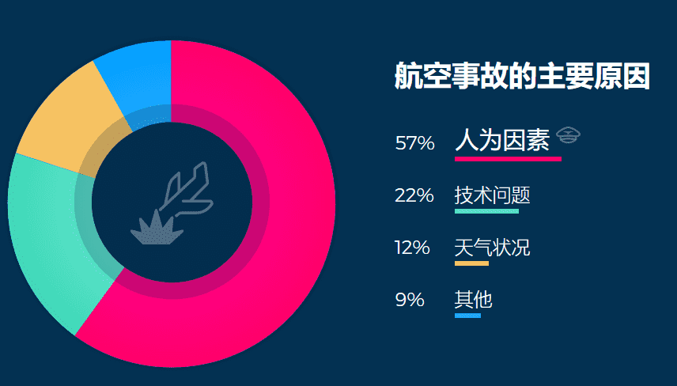

# Aeron(ARN)

**一、项目简介**

Aeron旨在创建“口袋中的航空公司”——一种基于智能区块链的解决方案。飞行员使用飞行员应用程序进行个人飞行日志录入。公司应用程序则手机和验证源自飞机运营商、维护机构、飞行学校和固定基地运营商的数据。如果任何Aeron数据源与空中交通管制、飞行员或运营商之间的数据不匹配，航空当局可以快速检出并排除问题。
Aeron（ARN）作为多用途代币将被纳入Aeron产品当中。它有助于增强产品用途，能够对生态系统、产品准入和所有权方面做出贡献。ARN是一种自展性协议。虽然代币将允许访问Aeron平台中有价值的功能，但它不会受到Aeron移动应用程序的限制。

**二、应用场景**

飞行员能够记录飞行小时数并提交数据。应用程序还提供忠诚度计划，得到最好的策化服务
消费者乘客和航空学校的学生可以共享全球航空服务数据库aerotrips.com
航空管制在选定的位置，空中交通管制数据将自动通过数据中心进行处理，并验证由飞行员和公司进行的日志记录（以确认实际起飞的航班）
公司应用维护组织记录服务数据，并通过公司应用提交到区块链，航空运营商录入飞行数据并通过公司应用提交到区块链，固定基地运营商通过公司应用将机场服务数据提交给区块链

**三、项目特点**

航空安全的改善可以通过使用块链技术来实现。
它将排除数据丢失，扭曲或伪造重要日志的可能性，从而大大降低致命事故的风险。信息应该是透明公开的，可供当局提高安全性。如果任何数据来源与飞行员或运营商之间的数据不匹配，航空当局可以快速检测并解决问题，航空当局还可以检测所有使用过期许可证的飞行员

相关链接：
https://aeron.aero/
http://www.120btc.com/baike/coin/5610.html

 

**航空团结世界。**

今天，它已经成为我们生活和工作中不可替代的一部分，更重要的是，它使我们有更多时间陪伴家人

有超过 **100000架航班** 在世界范围内一天时间生产出来，服务于 **200 万人**.尽管飞机被认为是最安全的交通工具之一，但与航空相关的事故数量平均每年约为3302次 **人为因素是最大的原因**.

   

- 飞行学校可能不正规 - 他们有动机去造假飞行员的经验。
- 飞机运营商可能会少报飞行时数 节省可观的维护费用。
- 缺少防止篡改日志数据的常规解决方案
- 航空经常以新技术替代旧设备和方案
- 飞行学校需要更复杂的工具来管理学生记录和飞机机队
