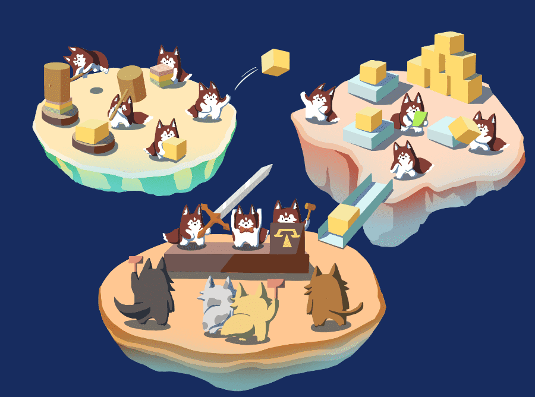

# Aetheras

**Aetheras** 旨在通过提供娱乐解决方案，创建改善生活的软件应用。他们的首个项目是内部开发的区块链，以服务于游戏行业的交易市场。

_*Agence是一个以应用为中心的NFT区块链，旨在提供一种连接游戏虚拟世界的方法。*

_*NFT被视为一等公民，具有链上功能，包括交易，拍卖，租赁和透明的RNG。*

_*Agence由游戏开发人员为游戏开发人员构建，旨在让开发人员轻松创建NFT游戏。*

**基于区块链**使用区块链技术，Agence通过区块链的固有属性保证公平性和透明度。在链上存储数据将确保数据不会被更改。

**游戏联盟**通过存储资产数据并可从链中轻松访问，游戏可以直接协作并支持彼此的数据。

**数据所有权**在Agence下，玩家拥有自己的资产数据。无论游戏是中心化还是分散式，数据都是供玩家保留和使用。
