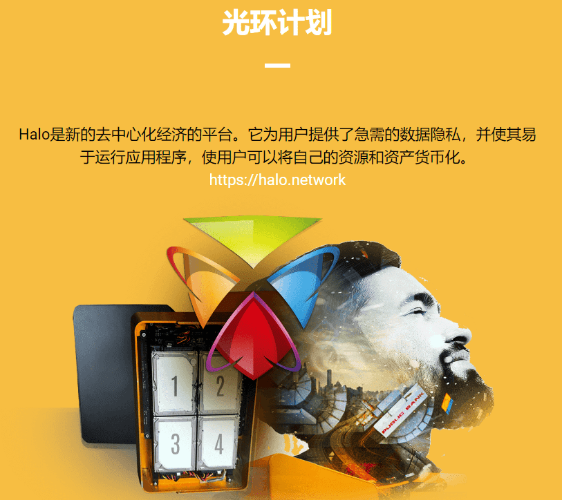

# 

# Akomba Labs

Akomba Labs 致力于区块链的可行性研究与开发工作，已经与区块链行业的一些知名企业合作过，为项目提供帮助。

#### 介绍

Akomba Labs是一家精品咨询和产品开发公司。我们与分布式技术行业的一些知名企业合作过。

Halo是新的去中心化经济的平台。它为用户提供了急需的数据隐私，并使其易于运行应用程序，使用户可以将自己的资源和资产货币化。

##### 概念 验证

想让您的企业从分布式账本中受益吗？

分布式账本技术的不当实施不仅令人不安地普遍存在，而且可能成本超过必要的成本，并危及公司的数据和安全性。我们帮助您了解DLT是否以及如何最适合您的业务，确定应该使用哪些技术来构建它，并帮助集成集中式或分散式基础架构。

##### 断续器 架构

新的架构需要新的范式。

即使是经验丰富的工程团队也需要了解它

我们将帮助您的团队设计架构，决定哪些数据应该放在分布式系统上，哪些数据应该保持集中，并提出一个符合数据存储、隐私和其他法规遵从性的所有法律和公司范围规则的解决方案。

##### 扩展 解决方案

可扩展性是分布式账本实现中最持久的问题之一

今天，在一个快节奏和数字化的世界中，交易速度预计将是即时的，DLT正受到其缰绳的阻碍。

作为第 2 层扩展解决方案的专家，我们将以等离子体的速度完成您的交易。

