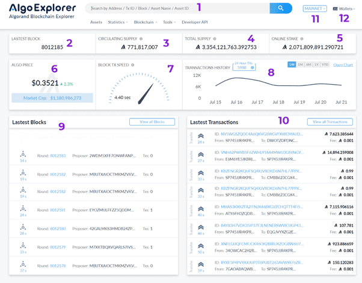

# Algo Explorer

Algo Explorer 是针对 Algorand 区块链的高级区块浏览器。

在互联网技术领域，一些工具或应用程序无处不在，与我们使用互联网的能力密切相关。其中一个工具是浏览器。互联网浏览器作为图形用户界面，将我们与我们使用的互联网应用程序上运行的软件代码和位的所有复杂性联系起来。对于不懂技术的人来说，它很有用，他们只是与计算机上的Web应用程序进行交互。

同样，区块链项目每天在分布式账本中存储大量碎片化信息。检索此信息既技术又繁琐。大多数区块链项目都有社区区块链浏览器，命名为区块链浏览器，它允许用户在区块链上搜索历史信息，以及某些功能在区块链上的工作方式。Algorand区块链至少有两个由社区维护的已知区块链浏览器。但是，我在这里有偏见，我将对AlgoExplorer进行审查，这是众所周知且设计精良的Algorand探索。这篇评论着眼于资源管理器的不同部分以及它们的含义。稍后，它还将涵盖其他Algorand探险家。
