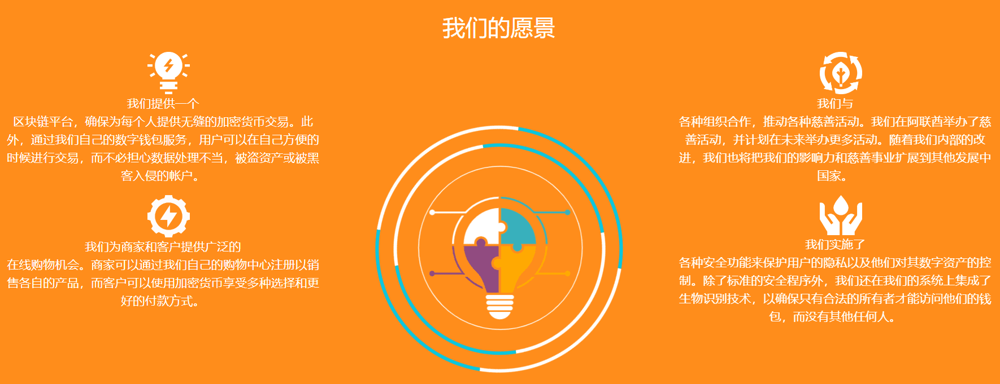

# 

# Alibabacoin(ABBC)

ABBC是一项运用了区块链技术的优化技术，功能包括了分销、金融、购物和安保。旨在开发面向加密货币市场和交易的面部识别技术和支付解决方案。ABBC币技术使用独特的区块链实施提供了安全且极其便利的付款方式。

#### 支付安全的未来

我们提供一个区块链平台，确保为每个人提供无缝的加密货币交易。此外，通过我们自己的数字钱包服务，用户可以在自己方便的时候进行交易，而不必担心数据处理不当，被盗资产或被黑客入侵的帐户。

### 简介

我们成立于2017年底，我们的创始人设想了一个更好的解决方案，以解决当前的电子商务问题，如支付缓慢，高额交易费用和有限的支付选项。我们提出了不同的解决方案，使在线购物和数字支付变得有趣，安全和简单。

我们主要在阿联酋迪拜和白俄罗斯明斯克工作。尽管如此，我们已经与来自世界各地的不同公司和组织建立了伙伴关系。这些是不同行业的专家，包括金融科技，网络和移动开发，人工智能和AR开发等。

我们不断创新，为您提供加密和区块链领域的最新技术和安全升级。我们将来会推出更多精彩的项目，以确保我们的安全和购物功能得到改善，为支付安全的未来铺平道路。

