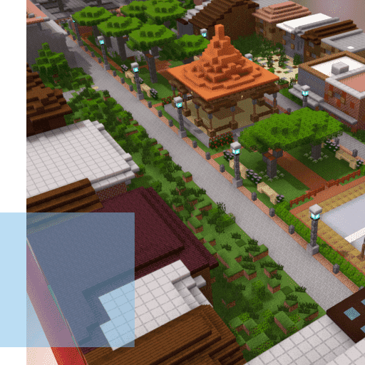

# Block by Block

每个人都可以从 Anthony Sassano 收集的加密与区块链研究和资源中受益，以便在这一激动人心的新领域中变得知识渊博。

# 关于逐块

Block by Block始于2012年，其激进的想法是将电脑游戏Minecraft整合到公共空间规划中，以使社区成员更多地参与其中。Minecraft易于使用，所有年龄，背景和教育水平的人都可以快速掌握它。这是一种非常有效且*经济高效的*方式，可以以专为快速迭代和想法共享而设计的格式可视化三维环境。Minecraft帮助社区居民对周围环境进行建模，可视化可能性，表达想法，推动共识并加快进度。

[内罗毕]和[孟买]的早期试点项目演变成目前的[Block by Block方法]，旨在吸引那些在公共项目中通常没有发言权的人 - 从妇女和儿童到老年人，残疾居民和难民。Block by Block为社区居民提供培训，工具和平台，以参与和贡献他们的想法，在一个协作过程中，帮助所有参与者扩大他们的视野。

结果是共同创造的公共空间，满足各种居民的需求，一种根深蒂固的主人翁意识，增加了长期成功的几率，并最终建立了更强大的社区。该进程旨在建立势头，并在地方、国家和全球层面动员社区参与和政策变革。

Block by Block基金会已经资助并启动了全球超过35个国家的数十个公共空间项目，在此过程中改善了数十万人的生活。Block by Block还[将其创新方法]提供给任何有兴趣积极吸引居民改善公园，市场，广场，游乐场，花园，滨水区，街道和其他共享空间的社区。通过 Minecraft 有所作为
Block by Block基金会使社区能够将被忽视的城市空间转变为充满活力的地方，从而提高所有人的生活质量。

我们独特的方法以Minecraft为中心，将其作为可视化和协作的强大工具，积极吸引在公共项目中通常没有发言权的社区居民。
赋权社区
逐个街区的项目通过改善公共安全，经济机会，获得清洁水，可持续性和宜居性来改变生活并振兴城市社区。
