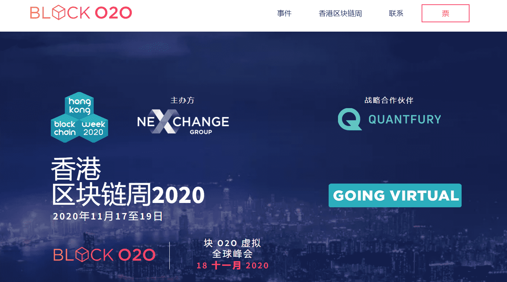

# Block O2O

Block O2O 区块链峰会呈现世界区块链生态系统，与 Fintech O2O 全球峰会一起，聚集了全球 1,500 名创业者、金融家、开发工程师、通证经济专家、监管机构和梦想家等。

##### 活动应用

## 参与当下

Block O2O由Nexchange应用程序支持。它将活动的代表联系起来，并通过有主持的问答和投票将他们带到舞台上。活动结束后，该应用程序将继续存在，将代表与金融，区块链和金融科技专家的全球网络联系起来。来自纽约和亚洲各地的行业报道的每日新闻每天都会让人们回到这个应用程序。

