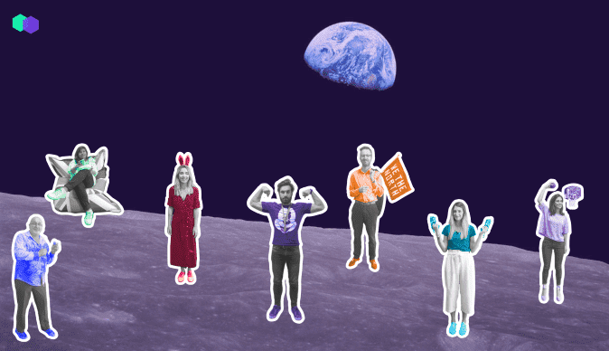

# Blockchain Land

Blockchain Land 于 2018 年在法国巴黎创办，这里是由区块链爱好者构思的游乐场，致力于为读者提供可靠、最新、富有洞察力的行业信息。

## 欢迎来到区块链土地

区块链土地于2018年在巴黎成立，由区块链爱好者概念化，他们对该领域和加密货币世界产生了兴趣。这是一个区块链故事，我们的游乐场，我们的游乐场，我们的区块链土地。你明白了吗？好了，我们可以继续。

*我们的使命*是为所有主要行业的每个人提供最新的新闻，深入的文章和初学者指南 - 从区块链爱好者到大时代行业参与者 - 提供情报，支持和专业知识，以了解这场分散化革命的持续转型。

*我们的愿景*是成为头号新闻中心。我们致力于为读者提供可靠，最新，有见地的信息。最终，我们希望在您身边 - 在地铁里，在家中等待晚餐烹饪时，以及在酒吧，当您试图向朋友解释区块链是什么时。

