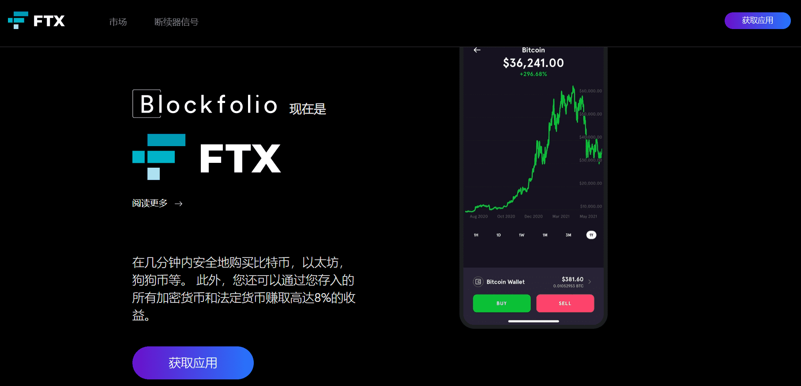

# 

# Blockfolio

主流加密数字资产管理应用。同时，Blockfolio 为项目团队建立的通信工具，便于直接与最活跃的支持者取得联系，直接从团队官方向任何人广播消息。

##### 受到超过600万人的信任，可以购买，出售和跟踪他们最喜欢的加密货币

最完整的加密应用程序，拥有超过10，000种加密货币的最新价格，重要新闻以及团队的直接更新。

##### 每笔交易超过10美元即可赚取免费加密货币

每笔超过10美元的交易都会让您有机会获得随机免费硬币。您交易的越多，您赚的就越多。

##### 在几分钟内购买和出售您最喜爱的加密货币

无论是比特币，以太坊，狗狗币还是更多，您都可以在几分钟内购买到您最喜欢的加密货币的1美元。

##### 掌握价格走势

详细的图表，价格警报通知，直接的团队更新和新闻使您永远不会错过任何机会。

##### 在500多个交易所跟踪您的投资组合

查看您在其他交易所持有的投资组合的损益，并通过几个步骤跟踪超过10，000种加密货币的价格。

