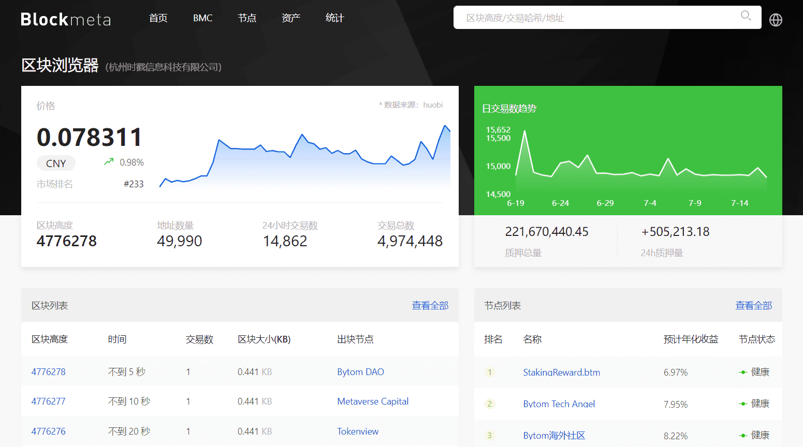

# 

# blockmeta

比原链官方区块浏览器，由比原链团队打造，旨在为投资者多维度展示链上数据以及全网算力数据

杭州时戳信息科技有限公司成立于2014年04月02日，注册地位于浙江省杭州市余杭区仓前街道鼎创财富中心1幢1106室-1、1207室，法定代表人为刘志鹏。经营范围包括许可项目：互联网信息服务；第一类增值电信业务；第二类增值电信业务；出版物零售(依法须经批准的项目，经相关部门批准后方可开展经营活动，具体经营项目以审批结果为准)。

一般项目：计算机软硬件及外围设备制造；计算机软硬件及辅助设备批发；计算机软硬件及辅助设备零售；区块链技术相关软件和服务；技术服务、技术开发、技术咨询、技术交流、技术转让、技术推广；信息系统集成服务；广告制作；广告设计、代理；广告发布（非广播电台、电视台、报刊出版单位）；品牌管理；会议及展览服务；翻译服务；软件开发；人工智能应用软件开发；企业管理咨询；信息咨询服务（不含许可类信息咨询服务）；从事科技培训的营利性民办培训机构（除面向中小学生开展的学科类、语言类文化教育培训）；文艺创作；票务代理服务；图文设计制作；市场营销策划；体验式拓展活动及策划；咨询策划服务；项目策划与公关服务；电子产品销售；人工智能硬件销售；玩具、动漫及游艺用品销售；玩具销售；箱包销售；服装服饰批发；服装服饰零售；家用电器销售；化妆品零售；化妆品批发；家具零配件销售；家具销售；灯具销售；汽车装饰用品销售；针纺织品销售；皮革制品销售；鞋帽批发；鞋帽零售；办公用品销售；体育用品及器材批发；纸制品销售；文化用品设备出租；日用百货销售；工艺美术品及礼仪用品销售（象牙及其制品除外）；机械设备租赁(除依法须经批准的项目外，凭营业执照依法自主开展经营活动)。

