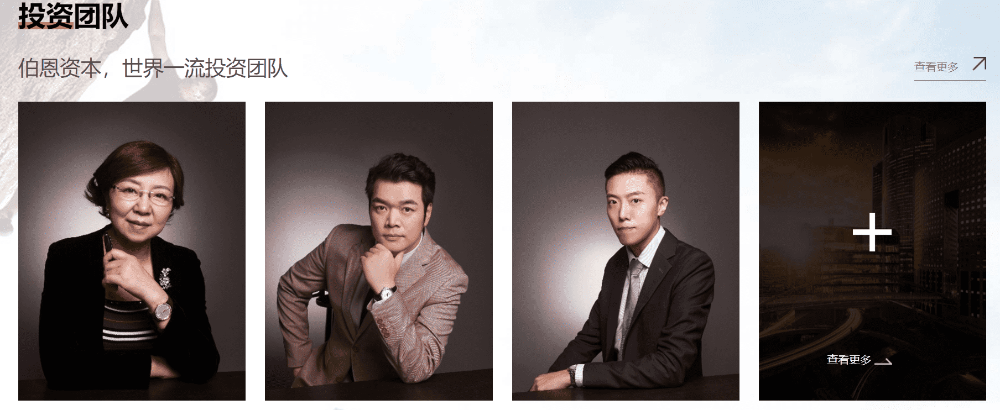

# 伯恩资本

伯恩资本是一支创新型的私募股权母基金，我们既投资全球顶尖的基金管理团队，也对优秀项目进行直投或跟投。伯恩系基金投资团队由美国哈佛大学博士后、北大产业技术研究院院长兼科技开发部部长、美国布朗大学博士、香港中文大学教授、国内外知名风险投资人以及来自各领域的专业团队组建而成，以数十位全国知名企业家作为基金后备力量，投资国内外优质创业项目，打造产业生态闭环。

伯恩资本是由十余位实业家共同发起成立的一级市场股权投资基金管理公司，并由专业的投资团队进行操盘。自2016年成立以来，伯恩资本直接或间接管理基金规模近10亿元人民币、投资项目近百个。

依托于投资人、基金管理团队和项目方的资源，伯恩资本在国内率先提出“生态基金”的概念。生态基金通过创业者、投资人和企业家的链接，形成人脉链；通过布局热点的上、中、下游产业，形成产业链；通过投资早、中、后期的项目形成资本链；共同打造“伯恩生态圈”，让生态基金内的各方共赢。

我们的投资合伙人既有成功的企业家、也有知名学者，投资布局包括人工智能、物联网、区块链、智能制造、量子计算、新能源、碳中和、大健康、新消费和教育等领域。我们立足当下、放眼未来，通过投资及赋能，与生态圈内的企业共同成长、勇攀高峰！

