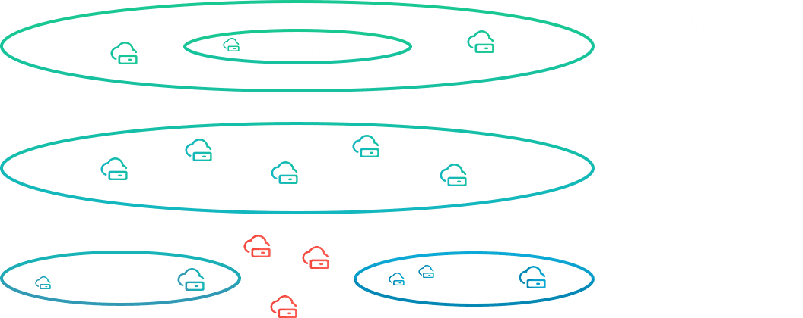
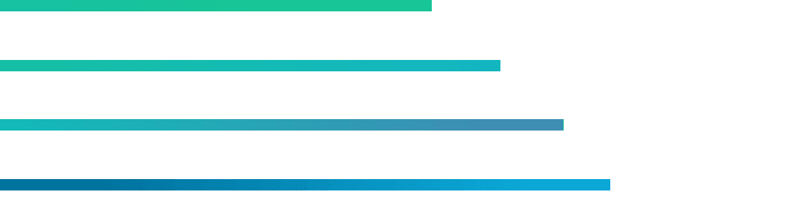
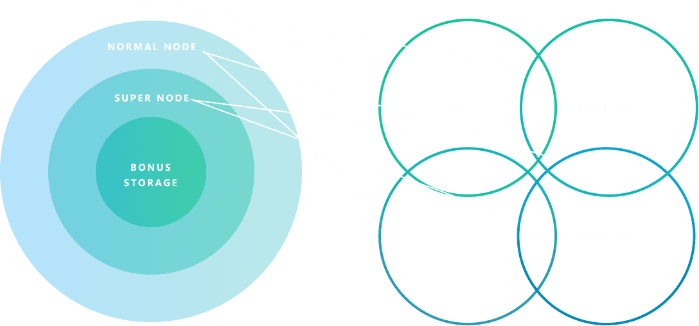
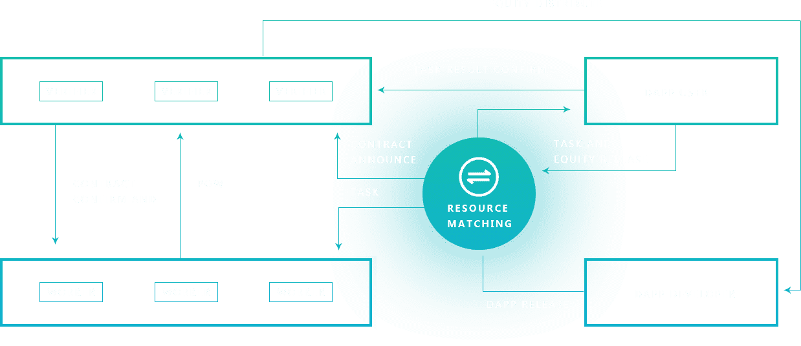

# 

# 

weight: 
title: "BonusCloud(BXC)"
description: "BonusCloud致力于打造一个去中心化的、可信任的、结合区块链与云计算技术的、全球化的基础设施平台，并构建一个基于此的开放式共享生态"
date: 2022-07-19T21:57:40+08:00
lastmod: 2022-07-19T16:45:40+08:00
draft: false
authors: ["MineW"]
featuredImage: "bonuscloudbxc.webp"
link: "https://bonuscloud.io/"
tags: ["数字代币","BonusCloud(BXC)"]
categories: ["navigation"]
navigation: ["数字代币"]
lightgallery: true
toc: true
pinned: false
recommend: false
recommend1: false

BonusCloud致力于打造一个去中心化的、可信任的、结合区块链与云计算技术的、全球化的基础设施平台，并构建一个基于此的开放式共享生态。旨在连接和利用各种具备计算能力的资源，转换为数字资产价值，在数字经济时代，让DApp赋能区块链应用创业者。BxC是BonusCloud平台的代币，用于奖励节点资源共享者。并且，用户可以通过BxC购买资源。

BonusCloud在Kademlia网络的基础上开发了一个独家加密网络，也可以根据用户基本网络的特征进行分割和聚合。

BonusCloud为社区提供不同类型的计算环境，以满足不同开发者的需求。

BonusCloud中的不同工作人员将根据其不同的存储和带宽能力分配以支持不同的场景。

BonusCloud为客户提供了一个开放和值得信赖的环境，以进行有价值的计算能力交换。

