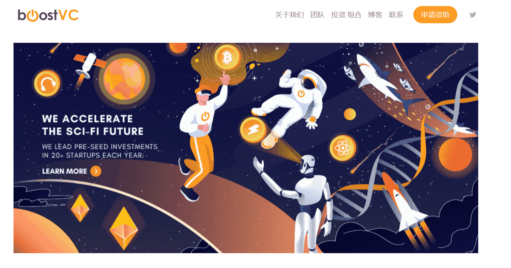

# Boost VC

Boost VC 成立于2012年，其至今已投资了Coinbase、Etherscan、Ledger、Abra等币圈著名公司

###  我们投资50万美元。

我们以50万美元的投资引领种子前的科幻回合。我们的目标是估值在300万美元至700万美元之间的初创公司。

### 我们首先相信。

收到我们的投资后，初创公司参加了我们为期3个月的入职计划，数百家公司已经完成并继续筹集数十亿美元。

我们知道您专注于建立自己的公司并与客户交谈，因此我们的计划旨在产生最大的影响，而不会妨碍您。这是一个与我们的团队密切合作的机会，建立一个网络，产生动力，并在时机成熟时利用我们的演示日平台为筹款做准备。

