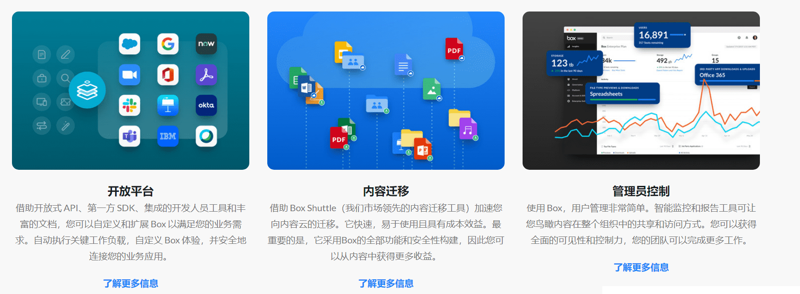

# BOX

BOX（企业级数字资产保险箱）是一套基于区块技术的企业级数字资产安全解决方案。它以区块链、密码学、通信安全等领域的公理性技术为依托，实现技术间的无缝衔接，从根本上解决了私钥被盗取和指令被篡改的行业痛疾。现阶段，BOX主要服务于数字资产交易所，数字资产投资机构以及相关创业团队。

# 简化工作方式

### 随时随地在任何设备上与任何人安全协作

####  无摩擦安全性

保护敏感文件是重中之重。因此，我们为您提供先进的安全控制、智能威胁检测和完整的信息治理。但是，由于您的需求并不止于此，我们还提供严格的数据隐私、数据驻留和行业合规性。

####  无缝协作

您的业务依赖于从团队和客户到合作伙伴和供应商的许多人之间的协作。内容云为每个人提供了一个共同处理您最重要内容的地方 ， 您可以放心，一切都是安全的。

####  强大的电子签名

销售合同、报价函、供应商协议：像这样的内容是业务流程的核心，越来越多的流程正在走向数字化。借助 Box Sign（Box 计划中包含的本机集成电子签名），您可以获得一种经济高效的方式来推动您的业务。

####  简化的工作流程

手动、繁琐的流程每天浪费数小时。因此，我们允许任何人自动执行对您的业务至关重要的可重复工作流程，例如人力资源入职和合同管理。工作流程发展得更快，您专注于最重要的事情。这是一个双赢的局面。

####  1，500 多个应用集成

借助 Content Cloud，您可以获得一个单一、安全的平台，用于存储所有内容 ， 无论其在何处创建、访问、共享或保存。超过 1，500 次无缝集成意味着团队可以在不牺牲安全性或可管理性的情况下按照自己想要的方式工作。

