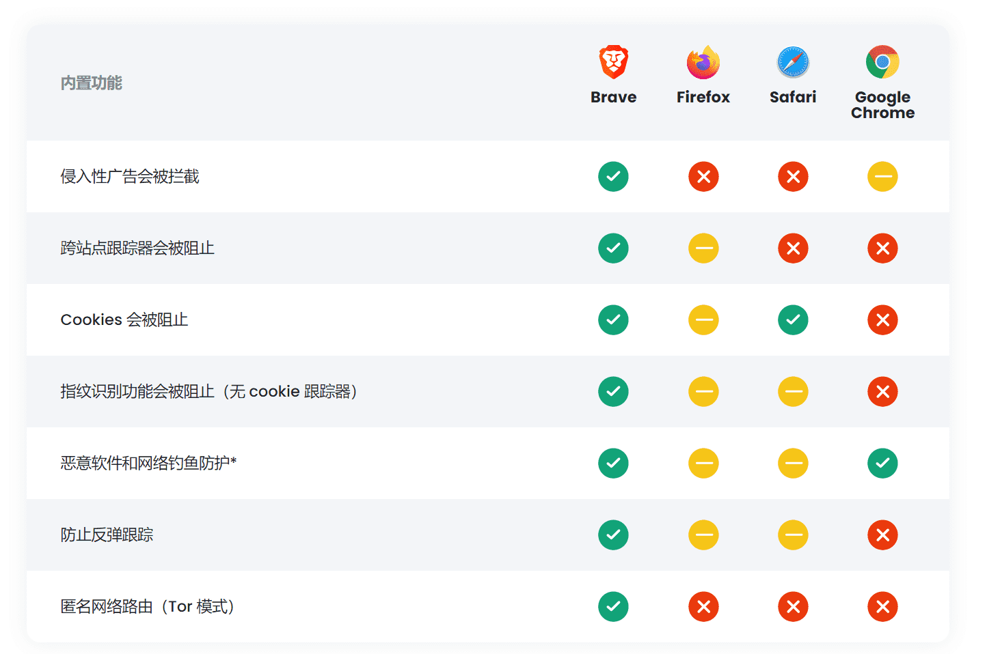

# 

# Brave

Brave 浏览器将引入基于区块链的代币体系和经济激励机制，实现对中间环节的去中介化，实现高效精准的广告传播，进而为内容生产者增收，用户也将因此获得更好的访问速度和更好的隐私、安全保护。

### 避免在网上被跟踪
默认情况下，Brave 会阻止来自每个网站的所有令人毛骨悚然的广告。广告在整个网络上跟随您的那个东西？Brave 也将其阻止了。

### 简化了在线隐私
具有广告拦截、隐身窗口、隐私搜索，甚至 VPN 的所有好处。只需单击一下即可。

### 60秒内切换
可快速导入书签、扩展程序，甚至保存的密码。它是旧浏览器中最好的（只会更安全），而且切换只需一分钟。

### 新的超级应用
Brave 带来了真正的[独立搜索]、[免费视频会议]、[离线播放列表]，甚至还有一个[可自定义的新闻源]。都是完全私密的。所有这些功能都被带给了您的浏览器超级应用程序。

### 您可以看到……和感受到的差异
没有令人毛骨悚然的广告和跟踪器意味着您访问的每个网页上的内容（可见的或隐藏的）都会减少。这意味着页面加载速度更快、电池寿命更长，甚至还可以节省移动数据。

