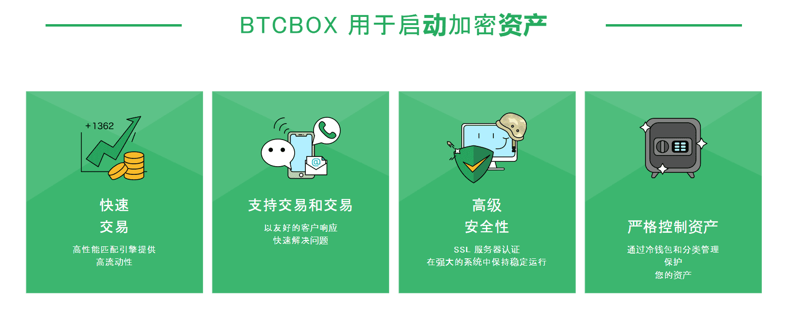
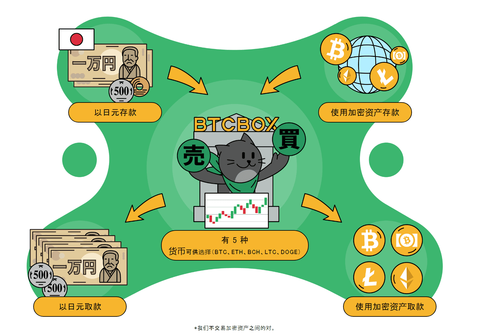

# BTCBOX

BTCBOX是日本的比特币国际站，日本金融厅首批颁发交易牌照的11家国际站之一。2014年三月成立于日本东京。2016年8月获得上市公司梦真2亿日元投资，其大客户主要包括专业交易者和大贸易商。国际版于2016年八月中旬上线，以比特币为基础货币，只进行币币交易。国际版的BTCBOX不需要银行账户，不需要进行实名认证，注册更加便利、省时。BTCBOX推出的国际版将支持日文、英文、中文三种语言版本。BTCBOX于2014年成立以来，2年间无事故运营，甚至连服务器宕机的情况都没有出现过，一直把交易系统和客户资产的安全放在首位。BTCBOX所有系统运行管理都需要设定二次验证，让客户用的更安全，更放心。

BTCBOX在日本金融服务局正式注册，我们目前是日本比特币订单簿交易持续时间最长的加密货币交易所。自2014年4月开始服务以来，我们在5年内没有发生过一次泄漏或事故，我们的销售点由于安全级别高。我们公司目前接受交易的硬币是比特币（BTC），比特币现金（BCH），以太坊（ETH）和莱特币（LTC）。

作为我们的客户支持系统，我们通过电话，电子邮件和聊天门户提供支持，并提供日语，英语和中文的客户服务。它不依赖于任何外部部门，公司内部部门独立工作，很好地掌握了所有内部信息，因此我们可以提供高质量的客户支持。

客户资产存储在经过评估和验证的安全钱包中。它被编程为几乎离线，因此它可以防止网络攻击和互联网威胁。此外，钱包本身受到全面保护，以防止被盗和丢失。

不仅是我们的钱包，而且主订单簿交易系统和我们的交易场所已经清除了1000多次验证测试，以保持系统的高度可靠性。最重要的是，为了保持我们的高度安全级别，我们还有第二个验证步骤。

