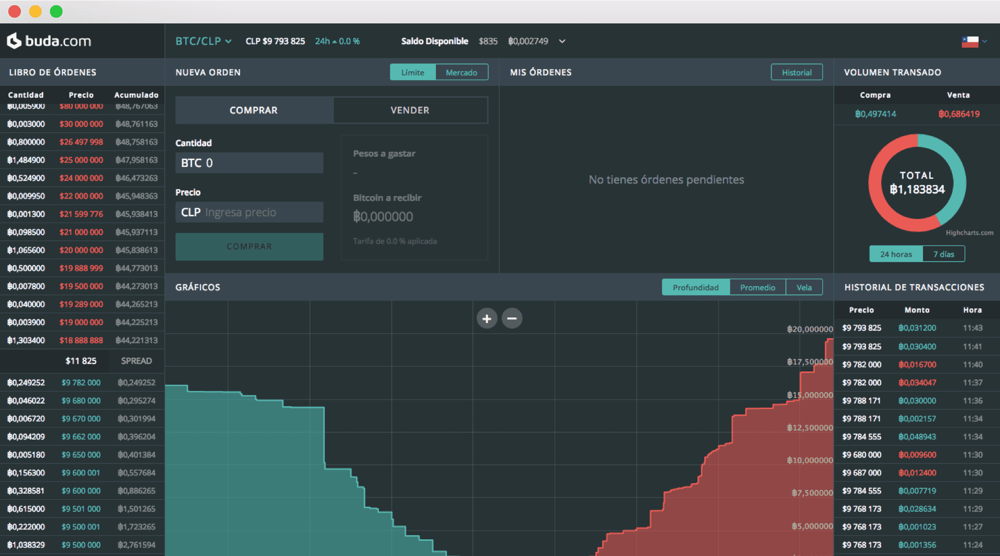

# Buda

Buda，是智利的第一家比特币国际站。

#### ‎安全‎

‎超过90%的资金存储在与互联网断开连接的保险库中。‎

#### ‎流动性‎

‎我们积极与交易者和流动性提供商合作，以拥有最深厚的加密货币市场。‎

#### ‎99，9% 正常运行时间‎

‎我们的承诺是提供一年365天，每天24小时提供服务。‎

## ‎面向初学者和专业人士的单一平台。‎

‎在具有您需要的所有工具和功能的平台上交易比特币，以太坊，莱特币和其他加密货币。‎

‎Buda.com SpA‎‎及其子公司在当地金融监管机构面前不是受监管的实体。尽管有上述规定，我们仍然根据我们经营的每个国家/地区的现行法规维护法规遵从性标准，并受相关立法的约束。‎

‎为了使行业负责任地发展，重要的是我们所有的用户都知道：i.加密货币不是法定货币，也没有中央银行的支持;ii. 一旦加密货币转移正式完成，就不可能逆转;iii. 加密货币是价格完全由供求关系达到的资产，并且可能高度波动;iv. 加密货币受到任何虚拟交易活动中固有的技术、网络和欺诈风险的影响。‎

‎我们邀请您以负责任和知情的方式参与这场技术革命，并就您在 soporte@buda.com‎
