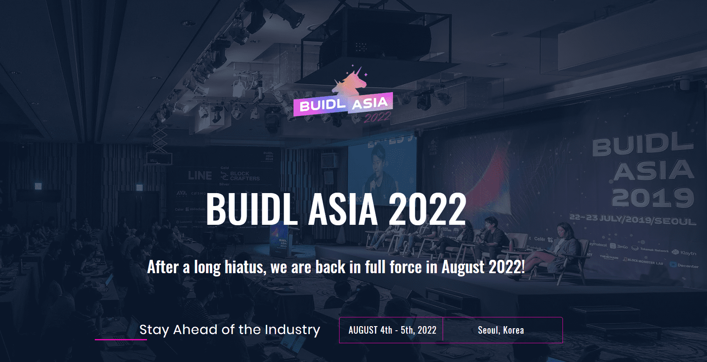

# 

# BUIDL Asia

BUIDL 以社区为主导，以开发者为中心，其使命是专注于区块链行业的实际建设，无论是协议、产品还是生态系统，旨在深入探讨有关该行业的技术和学术问题。他们希望阐明真正为行业做出贡献的项目，并促进有关安全、隐私、链接协议和区块链等企业项目的技术讨论。此外，论坛将深入研究本质上和潜在的用例价值。

#### ‎大约‎

BUIDL Asia 2022由KryptoSeoul主办和组织，是全球开发人员，社区和企业之间互动的终极机会。BUIDL Asia 2022将为您提供来自最具创新性和才华的头脑的最新见解和发展。‎ ‎ ‎ ‎作为一个以技术为重点的会议，BUIDL Asia 2022将100%关注建筑商和技术，0%关注炒作和投机。BUIDL周主要由HackAtom Seoul，BUIDL Asia 2022会议和ETH Seoul组成。请加入我们，让我们一起BUIDL！‎

