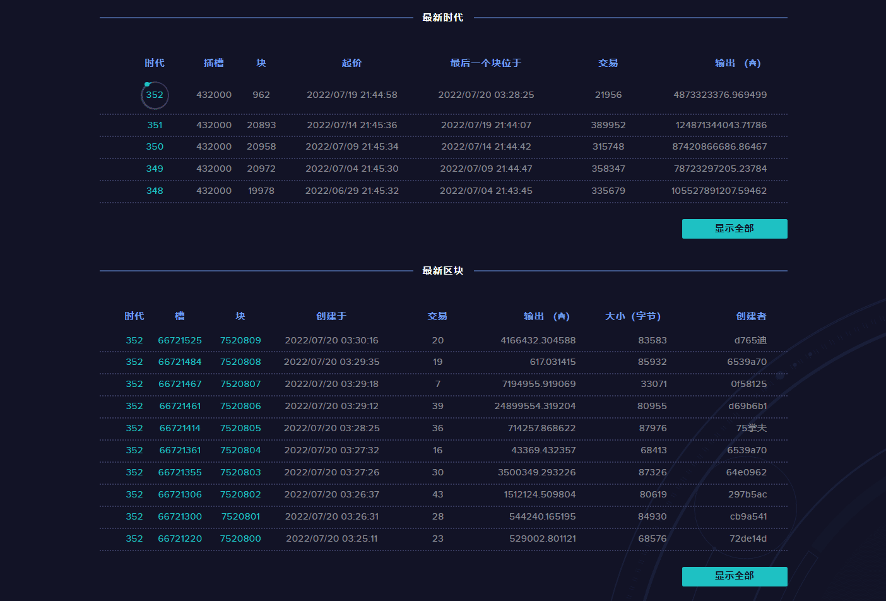

# Cardano BlockchainExplorer

卡尔达诺（ADA）区块链浏览器，可以搜索出交易地址、交易哈希、时间戳、区块大小

##### 卡尔达诺是一个[开源](https://github.com/input-output-hk)项目。

卡尔达诺只是一个软件平台，不对任何区块链，数字货币，加密货币或相关技术进行任何独立尽职调查或实质性审查。您使用本网站和软件的风险完全由您自己承担，本网站按“原样”提供，仅供参考。

卡尔达诺仅是一个软件平台，不对任何区块链资产，数字货币，加密货币或相关资金进行任何独立尽职调查或实质性审查。您全权负责评估您的投资，决定您是否将根据自己的判断交换区块链资产，以及您关于是否与卡尔达诺交换区块链资产的所有决定。在许多情况下，您根据研究进行交换的区块链资产可能不会增值，价值可能会下降。同样，您根据研究进行交换的区块链资产可能会在交换后贬值或上升。

