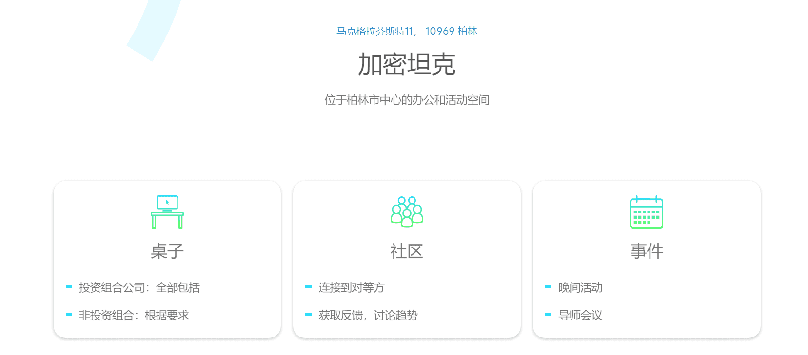

# Catena Capital

德国区块链风险投资基金，与创业孵化加速器。
Catena Capital是一家总部位于柏林的公司建设者和早期投资公司，专注于代币经济和分散式系统。

### 我们的愿景

每一代人都有改变世界的机会

我们相信区块链技术是无与伦比的颠覆性力量，可以为我们提供动力。最伟大的创新在一个共享其背后愿景的网络中增长。投资区块链社区意味着投资我们世界的未来。这就是Catena所代表的。

### 我们的使命

为了释放区块链的潜力，我们的使命不仅仅是将空间中的大脑，有远见的人和爱好者聚集在一起。我们提供资金和区块链专业资源，以基于改变行业和基础设施的产品和服务建立可行的业务。

### 积极采购

从突破性的技术到对加密和区块链社区有用的产品，我们采购最好的项目：

