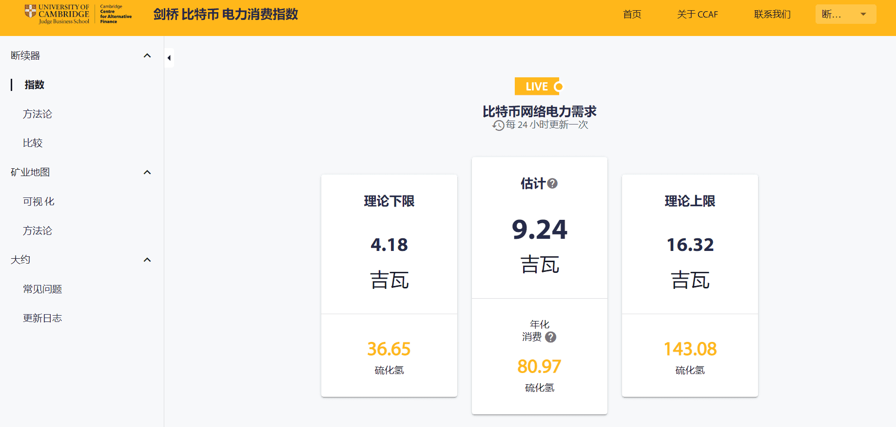

# CBECI

CBECI，剑桥比特币电力消费指数，由 CambridgeAltFin CJBS 创建和维护，提供了一种实时模型，可跟踪比特币网络的年度用电量。这一试点项目，旨在回应对比特币挖矿的可持续性和环境影响的日益关注。他们希望提供公正客观的比较基础，以便访客可以进行独立评估。

剑桥替代金融中心（CCAF）的使命是创造和转移知识，解决金融部门中支持循证决策的新兴差距， 是剑桥大学剑桥法官商学院的研究中心。CCAF成立于2015年，致力于研究传统金融之外出现的技术支持和创新工具，渠道和系统。该中心发布了40多份高影响力的行业和监管报告，并对超过185个国家的4，500多家金融科技公司进行了调查。CCAF还与全球120多家监管机构和中央银行合作进行监管研究。通过其剑桥金融科技和监管创新（CFTRI）在线教育计划，该中心已成功为来自140个国家的300多家机构的1，200多名监管机构和中央银行家提供了在线能力建设和教育。

剑桥比特币用电量指数(Cambridge Bitcoin Electricity Consumption Index)实时估算了比特币网络每年的用电量总量。 底层模型根据实时价格和哈希率数据每30秒更新一次网络功率估计。 

