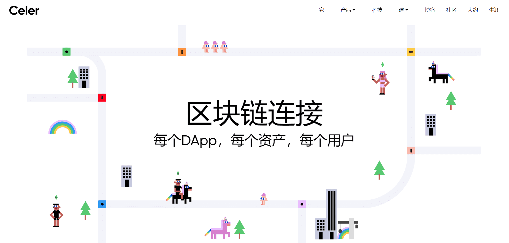

# 

# Celer Network(CELR)

Celer Network是个高性能Layer 2扩展性平台，旨在通过以上技术革新实现将互联网规模带入区块链，帮助区块链商业化落地的宏大愿景。其在传统链下解决方案的基础上提出了新的技术解决方案和经济模型，且该方案经过实验模拟结果显示有数量级的性能提升。CELR Token可用于流动性资金借贷防欺诈债券的抵押金、支付通道注册费的支付媒介、交易手续费以及其他可能的服务费。此外，在系统运行的前5年，新的CELR Token将通过PoLC挖矿产生，而LiBA只需要将 Token进行抵押，抵押期后CELR仍归属于贷款方。当5年PoLC挖矿期结束后，LiBA将开始消耗CELR，被消耗的CELR将不再返回给贷款方，而是作为连续的PoLC挖矿奖励注入系统。

Celer 是一种区块链互操作性协议，可实现跨多个链访问令牌、DeFi、GameFi、NFT、治理等的一键式用户体验。开发人员可以使用 Celer 链间消息 SDK 构建链间本机 dApp，以获得高效的流动性利用率、一致的应用程序逻辑和共享状态。支持Celer的dApps的用户将享受多样化的多区块链生态系统的优势，以及单一交易UX的简单性，所有这些都来自单个链。

Celer Network由麻省理工学院，普林斯顿大学伯克利分校和UIUC的计算机科学博士于2018年创立，旨在将区块链技术大规模采用。2019年，Celer Network在主网上推出了世界上第一个广义状态通道网络，该网络允许同一区块链上的用户在保持可扩展性的同时实时相互交互。随着区块链生态圈向更加多链的世界迈进，赛乐网络扩展了其核心技术，特别是广义状态通道网中使用的国家守护网络，并将其转变为广义的区块链间和跨层通信平台。这种转变导致了Celer链间消息传递框架（Celer IM），cBridge和layer2.finance的创建。今天，Celer Network拥有一支强大的全球团队，致力于推动区块链大规模采用的不变目标。

