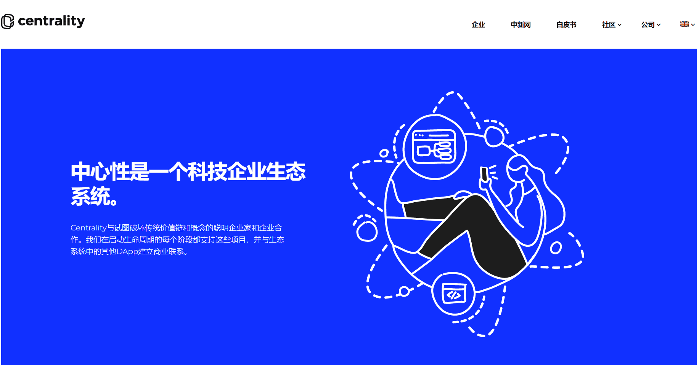

# 

# Centrality(CENNZ)

Centrality是一家位于新西兰奥克兰的区块链平台和风投企业，位于墨尔本，新加坡，奥克兰和伦敦。Centrality构建了CENNZ网络和CENNZ软件工具。Centrality正在构建一个由核心服务组成的平台。这些核心服务将为DApps构建用户创造更加平等公平的环境。CENNZ是Centrality代币，代表Centrality主网（CENNZnet）的股份。CENNZ为Centrality生态系统提供燃料。为确保平台和基础设施去中心化，基础设施的所有权也必须去中心化。CENNZ持币者享有社区股份分红。

Centrality是一家总部位于新西兰的公司和技术风险投资平台。我们利用区块链、人工智能、物联网和其他新兴技术来创造一个先进和互联的世界。我们正在培养以用户为中心的方法和开源文化，为新兴的分散式网络构建基础设施。我们的生态系统正在与开发商，企业，合作企业和初创公司一起成长，他们热衷于共同创造一个蓬勃发展的分散式未来。

Centrality的使命是建立一个始终将用户放在首位的生态系统，我们相信这就是将日常人们带到区块链并最终导致大规模采用的原因。我们的生态系统为大约100万活跃用户提供服务，这仅仅是个开始，我们希望您加入我们的旅程并共同成长。

