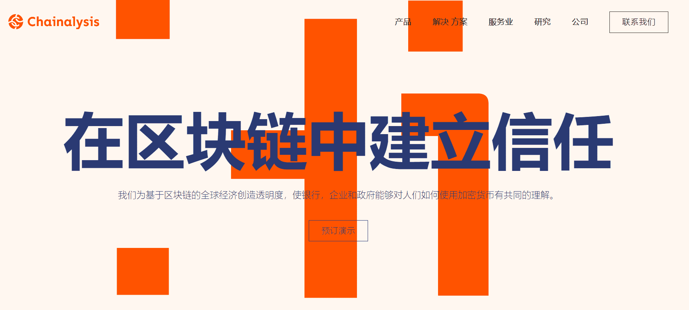

# Chainalysis

Chainalysis 成立于 2014 年，主要为加密货币交易所、国际执法机构、以及其他客户提供比特币交易分析软件，帮助他们遵守合规要求，评估风险，并且识别非法活动，希望成为数字货币与传统银行之间联系的桥梁。值得一提的是，该公司曾帮助调查 Mt. Gox 破产案。

Chainalysis是区块链数据平台。我们为 70 多个国家/地区的政府机构、交易所、金融机构以及保险和网络安全公司提供数据、软件、服务和研究。我们的数据为调查、合规和市场情报软件提供支持，这些软件已被用于解决一些世界上最引人注目的刑事案件，并增加消费者对加密货币的安全访问。

加密货币已经开辟了新的市场，使全球经济更大，更公平，更深入地整合。我们只是看到了这项变革性技术所能提供的开始。

但加密货币需要更大的信任和透明度才能充分发挥其潜力。这就是Chainalysis的用武之地。我们需要制定更清晰的法规，建立标准审计实践，并对加密货币实施强大的合规控制，以维持其当前增长并融入全球金融基础设施。通过我们的合规和调查工具帮助实现这一愿景，Chainalysis为银行、企业和政府提供了帮助这一新数字经济蓬勃发展所需的信心和知识。

