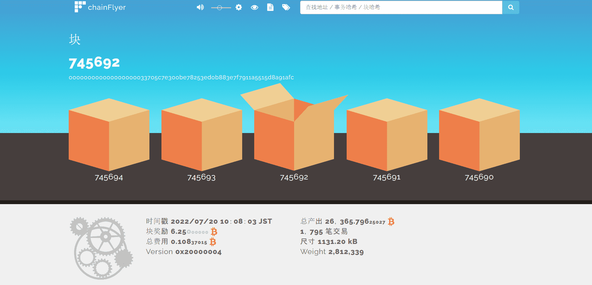

# 

# ChainFlyer

来自位于日本公司bitFlyer的区块链资源管理器服务，提供了易于理解的比特币结构可视化模型。

‎比特币地址就像‎‎使用比特币的“帐号”‎‎。 比特币地址由 27 到 34 个字符的字母数字字符组成，从 1 或 3 开始，由公钥生成。 发送比特币时，请指定目的地的比特币地址。‎

\* 它类似于银行帐户的帐号。

 

此外，每个加密资产都有自己的存款地址（例如，比特币是存款比特币地址，以太坊是存款以太坊地址）。

当您从外部服务将比特币存入我们的客户账户时，请通过外部服务在送货地址（目的地）指定我们的客户存款比特币地址，并完成发送过程。

登录会员页面后，您可以在 [存款和取款] 屏幕上选择货币，并在“存款”页面上确认每个加密资产的存款地址（波纹还需要目标标签。）

