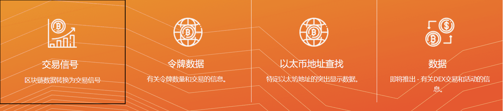

# chainradar

ChainRadar创建于2014年9月，为CryptoNote加密货币提供区块链资源管理器服务

*‎ChainRadar‎*‎已经建立了专有工具来分析公共区块链。从以太坊链开始，我们有能力检查和报告交易。

我们不断监控新区块，以寻找表明价格可能发生变化的信号。当我们看到它们时，我们会通过电子邮件或短信发送快速，准确的警报。您会收到警报并可以对其执行操作。

我们不会向您发送有关最新泵和转储骗局的谣言。我们使用机器学习和分析工具来提供最佳信息，以进行更好的交易。

我们即将推出，因此请立即注册，以便在我们的服务可用时收到通知。

