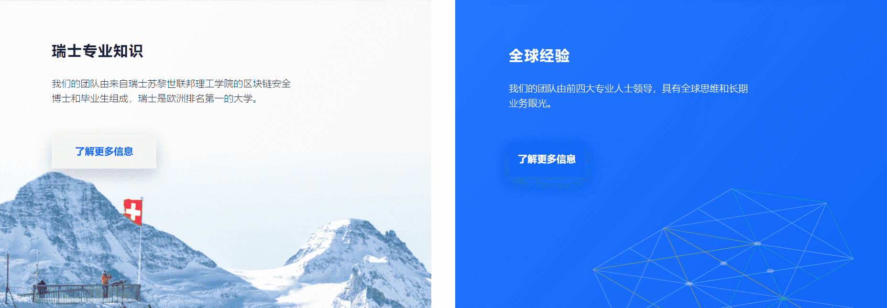

# 

# ChainSecurity

关于智能合约的首个代码审计平台，针对 Ethereum 和 Hyperledger Fabric 智能合约的安全性扫描，源于 Securify、ChainCode Scanner 创始者，基于苏黎世联邦理工学院 ICE 中心的最新研究。

我们的使命是在区块链生态系统中建立信任，使这项新兴技术能够在已建立的组织，政府和区块链公司中发挥其潜力。

ChainSecurity由来自苏黎世联邦理工学院的安全专家领导。我们受到85多家区块链公司和成熟公司的信任，并提供安全审计和服务。

