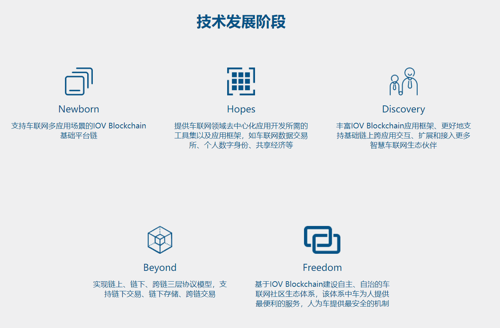

# 

# 车联网币-IOV Blockchain(IOV)

IOV Blockchain是车联网区块链公链项目，旨在为全球13亿汽车用户提供服务。该项目基于6800万用户，拥有完整的汽车消费生态社区。在IOV Blockchain，我们为汽车生活社交贡献者、汽车生活消费贡献者、驾驶安全信息贡献者创造生态价值，实现区块链技术在汽车社交网络领域的垂直应用。

IOV Blockchain重构了车生活数据价值分配规则，解决了汽车生活消费信任、交易成本高昂以及安全问题。IOV Blockchain的技术将基于以太链和EOS链进行token部署和激励体系的的应用开发，创建自主数字身份，存储在去中心化区块链平台，并将其和小车哎哟及御途优选的现有账户进行映射共存。第二阶段将开发实现一个车联网行业垂直领域的区块链底层平台，该平台提供一个完整的汽车生活社交生态的完整分布式账本与智能合约体系，专注于车联网垂直行业领域的同时，应用跨链技术与其他公有链实现跨链价值转移与去信任交易。
车联网币，是IOV Blockchain车联网链的唯一代币，基于以太链ERC20开发部署，代币符号是IOV。IOV代币用于汽车生活的社交行为数据贡献激励、车生活消费贡献激励、车辆行驶信息安全应用的贡献激励，也将用于社交赠送、车生活消费支付、矿工费支付，以及年度贡献分红等，具有广泛的流通价值和收藏价值。

IOV Blockchain是为智慧车联网行业领域提供基础区块链底层平台，该平台将可以为全球20亿辆汽车的用户群体和万亿美元级规模汽车消费市场，提供去中心化应用服务，并拓展到出行相关的多场景应用，彻底颠覆传统中心化的运营模式，为用户带来全新、快乐的车生活体验。

