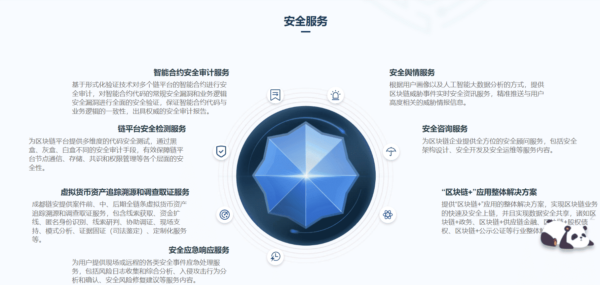

# 

# 成都链安科技

链安团队创立于2014年12月,链安以创新为主导，创造下一代各类技术，从数据分析，数据预测，网络攻击预测、犯罪预测等，目前已申请多项发明专利

### 关于我们
成都链安科技有限公司，全球领先的区块链安全公司，致力于区块链安全生态建设，总部位于四川成都。基于网络安全、形式化验证、人工智能和大数据分析等四大技术打造的“链必安一站式区块链安全服务平台"，囊括“六大核心安全产品”和“六大明星安全服务”，实现区块链系统“研发→运行→监管"全生命周期的安全解决方案。

凭借雄厚的综合实力，已获得前海母基金、联想创投、复星高科等知名机构的多轮投资，并与工信部、中国信通院、网信办等监管机构，以及蚂蚁链、腾讯区块链、长虹、泰豪、微众银行、万向区块链、布比等国内外100多家区块链头部企业建立了深度合作关系，核心技术全部具有自主知识产权，并申请知识产权30+，参与了多项国家级区块链安全标准和白皮书的撰写。

技术实力领跑行业，成都链安有幸成为工信部网络安全技术应用试点示范项目单位、CNVD国家区块链安全漏洞平台的主要技术支持单位，中国信通院区块链安全测评合作单位，并作为“成都市区块链安全工程技术研究中心”的唯一运营单位。

成都链安以“让区块链生态更安全”为使命，为区块链生态的安全发展保驾护航。

