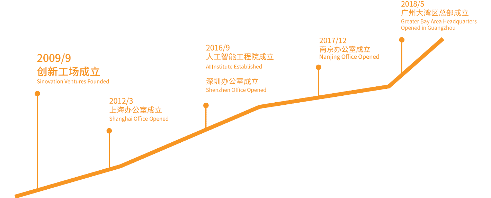
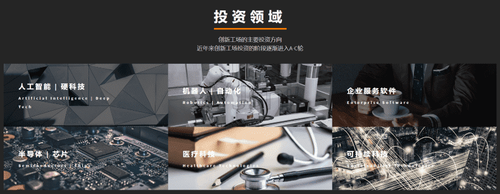

# 创新工场

创新工场由李开复博士创办于2009年9月，旨在帮助中国青年成功创业。创新工场是一家早期投资机构，同时为创业者提供全方位的创业服务。创新工场不仅提供创业所需的资金，还针对早期创业所需要的商业、技术、产品、市场、人力、法务、财务等提供一揽子创业服务，旨在帮助早期阶段的创业公司顺利启动和快速成长。

作为国内的创业投资与服务机构，创新工场深耕在人工智能与硬科技、机器人与自动化、芯片/半导体、企业服务软件、医疗等领域，并不断探索与创新，致力于打造集创业平台、资金支持、投后服务等的全方位生态投资服务平台。

