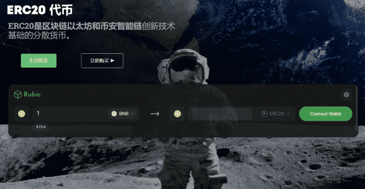

# 

# ERC20

### 1.简介

ERC20指数是一个代币化的加密货币指数，追踪和投资20个顶级代币，每周重新分配一次，每周以ETH的形式分红至前20名持有者的钱包，并完成ERC20指数的广告和开发。ERC20代币可用于提升技能，增加订单。用户可以在belance平台上作为版主获得ERC20代币。此外，ERC20代币还可用于安全交易和广告支付。

### 2.项目介绍

Belance 是一个庞大而独特的区块链平台，它在一个平台上结合了许多区块链机会。可以通过加密货币在线雇佣区块链专家或者自由IT职业者。BELANCE Blockchain通过更现代化，更高要求和更新的区块链革新易于使用的功能：最新的搜索算法：在Belance上获取altcoin问题所需的精确解决方案。
受信任的BLOCKCHAIN社区：区块链极客的值得信赖的现代化工作场所。
高级用户界面：与其他区块链平台不同，Belance推出了最新且易于使用的用户界面。代币用途自由职业者将使用ERC20令牌来提升技能
默认情况下，自由职业者按声誉排序。你拥有的声誉越多，就越有可能获得更多就业机会。 使用“PROMOTION AND BOOST”服务获得更多评级。评级将始终允许您进入TOP并在其他人中被注意到，这可以吸引更多关注您的技能，自己的作品，文章，活动，简介等。雇主将使用令牌来促进订单。
默认情况下，雇主按类别中的最新下订单排序。您拥有的声誉越多，找到您正在寻找的执行者或团队的速度就越快。使用“PROMOTION AND BOOST”服务获得更多评级。评级将始终允许您处于您需要的类别中，并在其他人中被注意到，这样可以吸引更多的注意力执行者到您的订单，接受更多的订单执行应用程序并评估执行者的工作。用户可以在Belance平台上获得ERC20令牌作为主持人
主持人将获得活动的代币和区块链平台的帮助。 对于他成功解决的每个争议，每个主持人可以将令牌加倍。希望担任主持人的人将被引导开始他们的职业生涯。ERC20令牌将用于安全交易选项
安全交易/安全交易允许用户通过网站使用它作为担保人进行结算，因此可以更加保护他们免受任何一方在他们所承担的义务方面的可能违规行为。反过来，该服务在有争议的情况下提供仲裁程序。令牌将用作广告的付款方式
其他不同的ICO项目和合作伙伴将有机会在Belance Blockchain平台上支付广告费用。 区块链行业最佳定位平台。 横幅系统，包含整个时间或选定时间段内每个横幅的详细统计信息。 服务将接受ERC20令牌作为付款。

相关链接：
https://index-erc20.io/
https://belance.github.io/

ERC20是一个开放且经过验证的源代码Solidity。在以太坊分散式网络上创建。

ERC20网络的任何成员都不能影响网络本身或交易，以及取消或更改其中的交易。

ERC20是以太坊网络上的标准。因此，ERC20令牌使用模拟和与区块链标准类似的名称。

这在加密社区中提供了优势和认可。以太坊区块链中的所有代币都是根据ERC20标准创建的。

---

ERC20的目的是成为交易，交易等替代方式的广泛采用。我们认为，进行不同的权衡非常有用，特别强调快速交易时间，安全性以及不同类型活动的能力（应用程序非常有效地交互）很重要的情况。ERC20令牌可以用作“数字货币”，现在可以立即以便宜的价格通过互联网发送。

ERC20令牌最初被认为是加密货币的升级替代版本，提供高级功能。更有趣的是，EC20令牌可以远远超出加密货币的范围。ERC20 Token围绕分散式区块链和分散式市场的智能合约，快速交易和其他优势，以及其他数十个此类概念，有可能大幅增加加密行业的功能和使用率，并通过首次增加经济层来为其他点对点世界提供巨大的推动力。最后，还有一大堆与金钱无关的潜力。

进步不会停滞不前，今后许多问题和难题是可以解决的。具有内置智能合约的ERC20令牌引入了用户的未来需求和愿望，并使得在没有银行或其他第三方外部中介机构参与的情况下进行可靠和保密的交易成为可能。

ERC20令牌实施的去中心化和“货币互联网”概念为用户提供 了独特的潜力;ERC20 Token不是封闭的，边界有限的，交易的时间有限，工具有限的，而是设计上的开放式，我们相信它非常适合作为未来几年大量金融和非金融世界的基础层。

