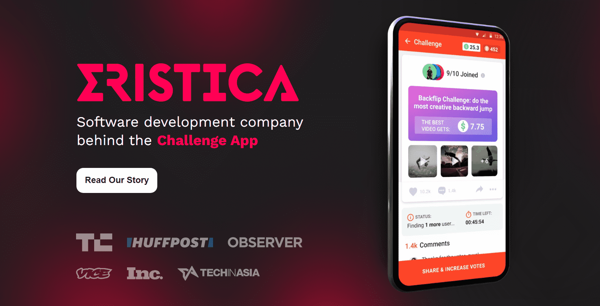

# 

# Eristica(ERT)

Eristica是一个面向挑战的P2P平台。Eristica整合应用内界面，以便用户以实时价格从交易所购买ERT代币。用户可以通过附加的信用卡/借记卡，本地支付或加密币进行支付。这将不断增长ERT代币的需求，提高ERT代币的流动性，促进Eristica社区的可持续发展。

Eristica加密货币硬币是一种使用区块链技术的数字货币。它创建于2014年，基于以太坊平台。Eristica加密货币硬币旨在提供一种更有效，更安全的交易方式。

Eristica是一个分散的平台，允许用户通过共享内容获得奖励。该平台使用权益证明算法，并允许用户购买ERT代币。

1.Eristica是一个允许用户买卖加密货币和其他数字资产的平台。

2.该平台提供广泛的功能，包括用户友好的界面，24 / 7客户支持和安全措施。

3.Eristica还提供多种付款方式，包括银行转账和信用卡。

