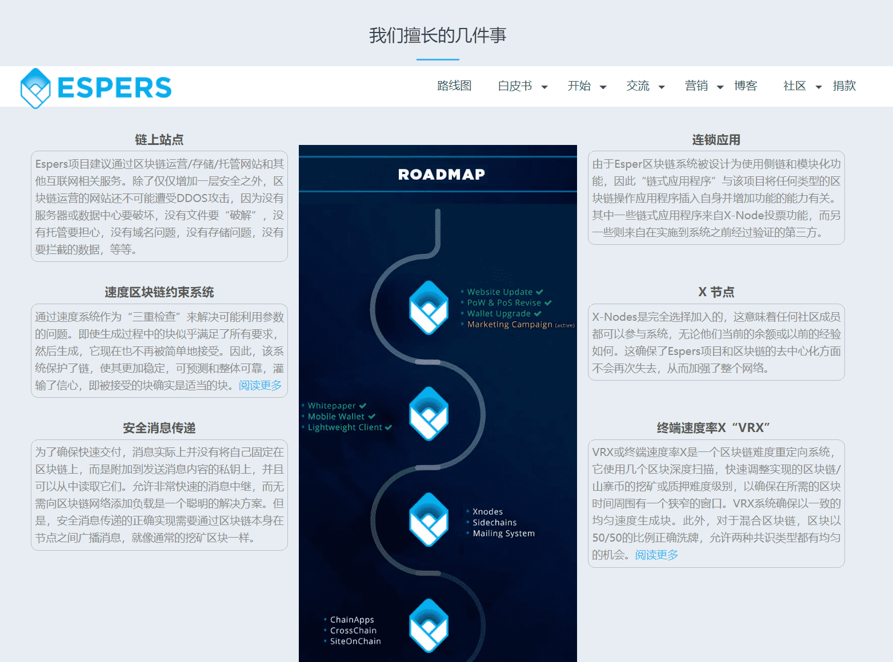

# 

# Espers(ESP)

Espers是一个区块链项目，其目标是提供安全的消息传递，链上的网站以及给用户一个整体愉悦的体验。Espers采用PoW/PoS混合区块链，旨在解决分区和实用性问题。ESP（Espers）币作为平台的“燃料”，推动链上服务的发展，进一步激励网络参与。

### 区块链技术

区块链技术有能力改变世界上的各种事物，也可以成为新互联网的支柱。区块链技术尚未产生影响的一个地方是区块链上的网站。然而，Espers正试图改变这种状况，并且正在朝着这个方向前进。

### 链上网站

Espers Blockchain将保持网站非常安全，并使其几乎难以穿透，这为网站安全和保障创造了新的标准。除了安全性改进之外，Espers Blockchain还将确保您的网站永远不会被删除或删除，无论如何。您还可以完全控制您的数据，并且这些站点将具有更快的服务器时间。

### 安全消息传递

除了将文本作为消息内容，Espers的消息传递系统还旨在处理和分发从基本图像到压缩文件和文档的所有内容，使其用户能够超越标准的纯文本限制。为了完成前面提到的侧链系统和跨链接口。

### Web3 分形引擎

一项全新的技术，将进一步增强我们的区块链！我们将很快发布有关此内容的更多详细信息。

