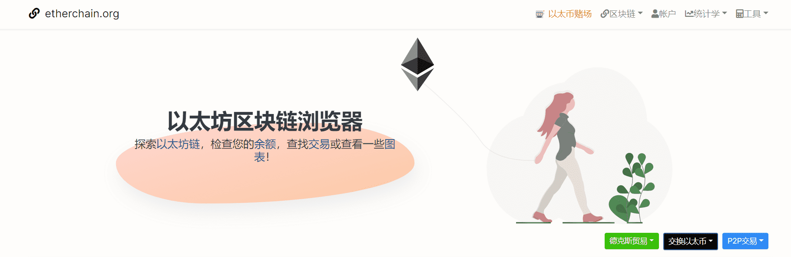

# etherchain.org

以太坊区块链资源管理器，掌控以太坊的实时信息，满足用户搜索需求

##### 探索[以太坊链](https://etherchain.org/blocks)，检查您的[余额](https://etherchain.org/accounts)，查找[交易](https://etherchain.org/txs)或查看一些[图表](https://etherchain.org/charts)！

