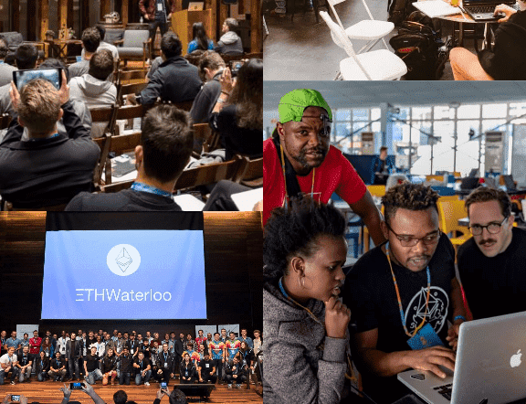

# 

# ETHWaterloo

曾经世界上最大的以太坊黑客马拉松 ETHWaterloo，旨在创建去中心化的未来。超过 400 位开发者参加，有机会与以太坊的行业专家们一起，在 36 小时的黑客马拉松中工作，这里是社区构建 Web 3.0 的最佳时机。

在世界上最大的以太坊黑客马拉松上构建分散的未来。加入其他300名雄心勃勃的开发人员，有机会在36小时的黑客马拉松中与以太坊的发明者一起工作。

加密货币领域的领先者正在加入来自世界各地的300多名黑客，共同使用以太坊在分散的应用程序上进行协作。随着采用率，开发人员兴趣和其他团队在以太坊之上构建的指数级增长，现在是成为社区构建[Web 3.0](http://gavwood.com/dappsweb3.html)的一部分的最佳时机。

对于希望成为去中心化未来的一部分的黑客和开发人员来说，这是一个活动。我们将汇集行业专家，推动该领域前进方向的公司，并处理所有活动细节;你需要做的就是准备好快速学习，并准备好建立一些伟大的东西。

