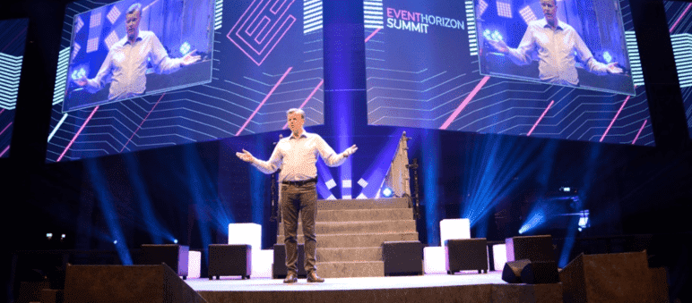

# 

# Event Horizon

EventHorizon 是以能源区块链解决方案为核心议题的年度活动，聚焦未来的可再生资源。一年一度，吸引到全球传统能源和区块链创新者们参与。

# ‎能源领域‎ ‎区块链技术‎ ‎全球峰会‎

‎Event‎‎Horizon‎‎是能源区块链行业的领先峰会。最进步的头脑一起展示能源的未来。‎

‎现在是改变的时候了。行动起来吧！‎

‎欧洲领先的‎‎能源区块链峰会‎

‎我们的使命是帮助能源市场实现碳零排放。我们相信，区块链正在改变我们生成、交易、跟踪和存储能源方式。‎我们从说服100家世界领先的能源公司加入进来开始，现在‎‎我们正在共同建设能源的可持续未来。‎

---

- ‎在能源中使用区块链‎
- ‎电动汽车管理‎
- ‎可再生能源证书‎
- ‎新产品展示‎
- ‎克服法律和监管挑战‎
- ‎开发正确的能源区块链用例‎
- ‎区块链解决方案合作伙伴‎
- ‎绿色信贷交易‎

