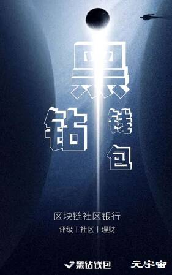

# 黑钻评级

黑钻评级是一个区块链评级社区，通过去中心化的方式，帮助投资者发现优质的区块链项目，降低投资风险，通过查阅了评审员们对某个项目的评价，如项目进展、持币结构、落地意义及价值等投资信息之后，帮助用户规避掉基础投资性风险。

黑钻评级是全球首家“评审团”式区块链评级社区,覆盖区块链评级、区块链行情预测、区块链爆料、区块链问卷调查等领域，汇集各类币圈大佬、区块链名人，为广大用户提供项目评级、区块链投资交流、区块链问答等服务。

据黑钻官方消息，黑钻评级和必达钱包于2020年8月15日进行了战略合并。

 

黑钻评级是区块链行业内知名的去中心化评级机构，其首创的评审团式评级深受用户喜爱；必达钱包主营staking服务，为区块链行业用户提供专业的staking服务。

 

基于对区块链行业的长期看好，以及发展方向的一致认同，经过双方团队慎重思考，决定将黑钻的评级业务和必达的staking业务进行深度整合，双方的优势互补，集中资源，更好的服务于区块链行业用户。

 

合并后的品牌名称为：黑钻钱包。产品定位：区块链社区银行。

 

黑钻钱包主营：staking服务、评级、社区等三大板块业务；将是区块链行业内首个具有评级和社区的钱包。
