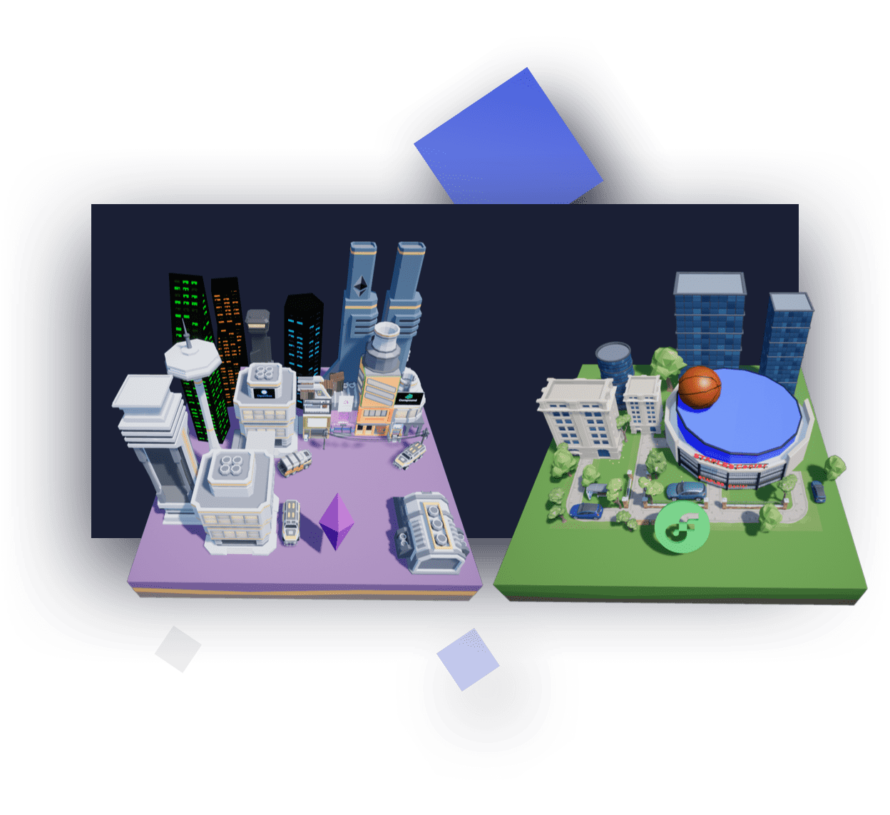
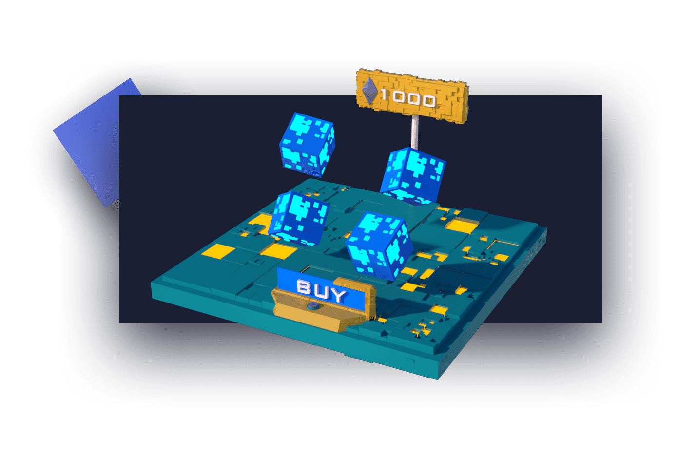
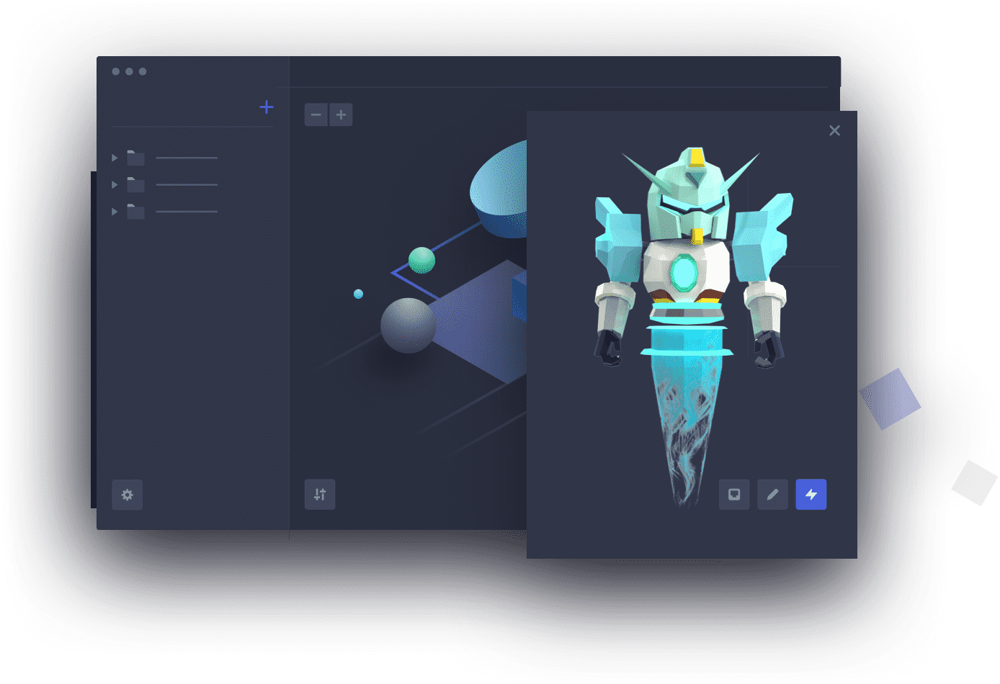
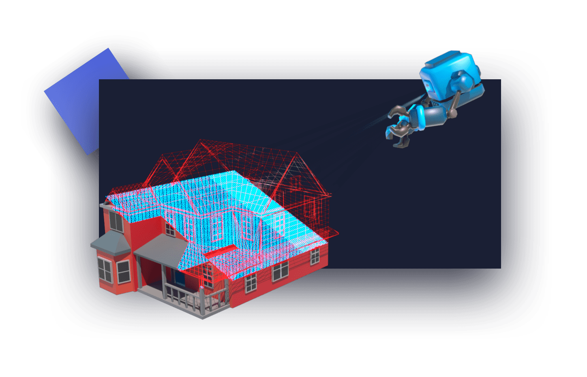
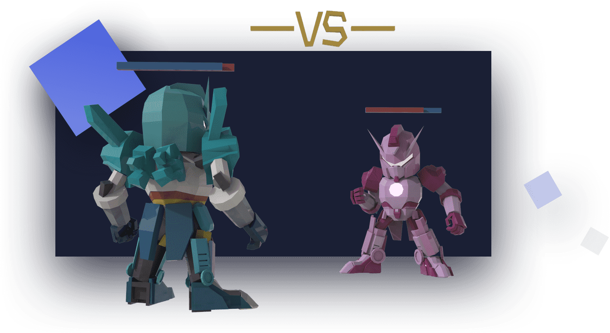

# 

# Matrix

Matrix World 是一个开放世界，使用户能够在多个区块链之上构建 3D 沉浸式应用程序。在 Matrix World 中，用户可以利用传统的 3D 开放世界功能，例如构建 3D 架构、举办虚拟会议、展示 NFT，以及更高级的功能。多链元宇宙

Matrix World是一个独特的虚拟世界，将支持不同的区块链基础设施。玩家可以探索具有不同链上身份的世界。

### - 沉浸式 3D 应用程序

创作者可以通过构建可以连接到外部服务和应用程序的沉浸式3D分散式应用程序（DApps）来丰富和扩展世界。例如，玩家可以通过来自OpenSea和其他市场的3D DApp直观地交易和购买NFT。

### - 可编程 NFT 和对象

所有游戏内对象和 NFT 都有自己的生命周期。土地所有者可以通过图灵完备程序自定义他们的行为，外观和转换。

### - 通过自动化进行创作

在区块链上导入各种NFT，并使用自动化工具创建游戏内建筑和建筑。

### - 游戏与娱乐

公共和用户创建的娱乐场所都将在虚拟世界中建造，包括3D游戏，NFT画廊和体育中心。玩家可以在这里享受他们的第二人生。

