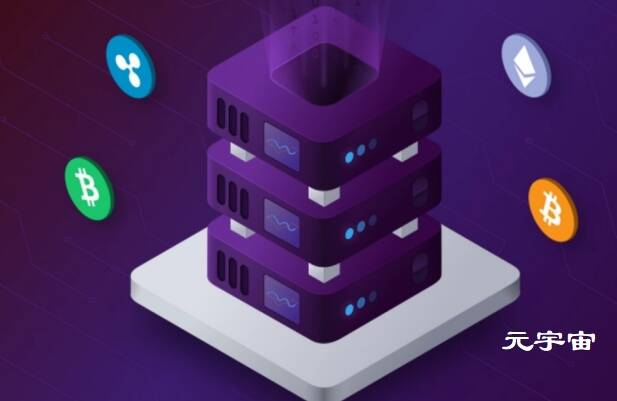

# MKR Tools

交互式界面，用于跟踪 CDP 债务担保与整个 DAI 系统，使用区块链作为事实数据来源。目前 CDP 余额可能不正确或同步不及时。由 MakerDAO 社区的 Michael 提供技术支持。

使用专有技术，Neutrino 开发了跨多个区块链监控、分析和跟踪加密货币流的解决方案，为整个加密货币生态系统提供了可操作的见解。现已被 Coinbase 收购。

**区块链技术通常被视为纯粹的货币视角**，但最大的范式转变可能会发生在社会的其他方面。区块链的非中心化、实时结算和可信的中立性为任何服务或行业提供了广泛的好处，允许两个不相关的各方以定义的方式交互。这个宽泛的定义描述了我们今天所知的世界的大部分，从金融到治理，以及将一套共同规则提炼成组织用来维持其结构的强制框架的任何官僚机构或社会方面。任何这样的系统都可以被代码编成一份智能合约，区块链以一种公正的方式在无限的规模上执行规则，这是任何官僚部门都无法企及的，区块链技术解锁的这一方面的效率收益和各种用例将是本文的重点。

去中心化金融，即DEFI，是在数字平台上重建现有金融体系，以提供更大的公平、透明度、效率和安全性。区块链是在数字空间中运行的整个经济体，没有国家边界内的实体，因此参与者需要所有相同的金融服务，如借贷、投资、资产管理和保险，而我们今天认为这些服务是理所当然的。

第一个主要的Defi协议于2017年12月发布，推出了**MakerDAO**，允许用户创建抵押债务头寸(CDP)，将ETH抵押，以铸造与美元挂钩的稳定货币DAI。该系统的运作方式是在支持资产的美元价值(ETH)和债务的当前美元价值(DAI)之间形成每小时比率，该比率必须由CDP的所有者保持在150%以上，否则这些资产将被称为Keepers的市场参与者出售以偿还债务并保持系统的全部资金。DAI是第一个去中心化的稳定币协议，并成为未来DEFI生态系统的基础。

在接下来的几年里，许多其他的Defi协议被开发和发布，大部分的使用和实验发生在众所周知的Defi Summer（DEFI夏天）期间。2020年6月15日，COMP借贷协议开始在现有利息收入的基础上，用自己的治理令牌comp奖励用户。这为贷款人提供了一种激励，让他们在协议中存入额外的资本，以获得高于市场收益率的收益，并使COMP借贷银行能够迅速扩大其用户基础和流动资金池。事实证明，这种激励措施是引导协议的强大工具，许多其他项目发布了自己的产量农业激励措施，导致Defi使用量激增，并为新的和创新的协议提供了一个竞争激烈的市场。

市场的一个基本组成部分是两个市场参与者之间的资产交易，DEFI通过Uniswap协议迎头赶上。Uniswap是一家自动化做市商DEX，它允许任何两种资产按照基于“不变积”公式x*y=k的数学曲线进行定价。与传统的订单簿交易系统不一样，它不需要做市商列出头寸促进交易，Uniswap允许交易员与支持这两种资产的流动性池单方面互动，从而在任何时候实现异步交易。

由借贷管理的信贷也是大多数人在想到金融时所想象的一个重要的基础层。这个市场竞争激烈，银行竞相提供汽车和房屋等资产的抵押贷款，以及基于信用记录的无抵押个人或商业贷款。DEFI目前以复合和AAVE等协议服务于抵押贷款市场，因为身份和信用历史系统尚未开发，但一些关于非抵押贷款的早期试验正在进行中。这些贷款协议的运作方式与庄家类似，支持抵押品的价值和债务的价值形成的比率必须保持在一定的门槛以上，以防止清算，关键区别是抵押品和债务可以以任何两种资产计价。由于这些协议在没有中介的情况下将借款人和贷款人联系在一起，贷款的管理费用降到了最低，这使得利率比传统金融系统中的要好得多。

金融最大的细分市场是衍生品，它允许在基础资产的基础上创造新的金融产品。这些虚拟资产的价值在于它们的功能和灵活性，可以很好地整合到像Defi这样的可编程和有表现力的市场中。Synthetix是一种著名的衍生品协议，它将股票、大宗商品和货币等链下资产与相应的价格预言机结合起来，并将其标记为合成资产，这些资产可以自由交易、杠杆操作，并整合到Defi生态系统的其余部分。流动性由SNX代币持有者提供，他们为交易对手提供交易，并在需要时对系统进行资本重组。合成资产为世界上许多缺乏AAPL等股票、黄金等大宗商品和欧元等货币的地区提供了极大的可用性。

随着金融体系的日益复杂，对冲基金、家族财富办公室和其他财富管理服务等专业基金经理应运而生。Defi向普通投资者暴露了更多的复杂性，已经创建了一些项目，通过将资产汇集在一起并提供一个精英管理系统来生成增长和保护共享资本的策略，从而简化资金管理和收益农业的体验。Yearn.Finance是此类项目中最大的一个，成立于Defi Summer，旨在提供一种更高效、更具可扩展性的方法来协调大规模产量农业战略。该项目已经扩大到通过激励社区成员创建最有效的策略来提供最受欢迎的Defi令牌的最高收益，开发商获得总利润的一小部分。另一个值得注意的项目是SET协议，它允许用户创建和共享自动交易策略或手动基金管理，其他人可以根据基金的历史和声誉选择使用这些策略。大多数投资者倾向于指数和对冲基金投资，以绕过积极投资的复杂性，因此分散的资金管理协议将成为Defi的一个越来越重要的部分。

预测市场是一种相对较新和强大的工具，由于监管和效率低下的问题，在传统系统中经常被忽视。这些制度允许根据诸如“谁将当选总统？”这样的问题创造市场。以及“周一伦敦会下雨吗？”在那里，任何人都可以打赌他们相信结果会是什么。博彩参与者受到激励，获得并使用详细的、可能是专有的数据，以做出最准确的预测，以增加利润。然后，社会可以使用这些准确的预测和结果来判断不同政府政策的有效性，或者将经过验证的结果用作其他应用中的先知。AUGUR协议允许用户为任何主题创建分散的市场，并通过REP令牌激励事件解决和冲突解决。

在与金融市场打交道时，安全至关重要，尤其是在部署了一份智能合同并负责数十亿美元的时候。保险通常用于减少高风险的金融交易，并在规划长期计划时提供保障，虽然金融协议通常由多家知名安全公司审计，但不能保证代码没有错误，因此分散保险的设计涵盖了这一用例。Nexus Mutual、Cover和Etherisc是提供智能合约风险保障的几个项目，其费率由市场参与者设定，争议解决由管理协议的DAO成员处理。保险协议还在开发参数保险的实例，使用分散的Oracle（预言机）来报告天气、新闻和其他事件数据，这些数据在特定事件发生时触发赔付。

DEFI正在以快速的速度建设，它具有公共问责、有保证的可靠性、可组合性和可访问性的特性，随着时间的推移，它很可能成为现有金融体系的基础。

**可编程媒体**

人类自文明之初就一直在创造艺术、音乐和模因等媒介，尽管分享媒介在整个历史中一直在不断演变。今天，我们的大多数媒体创作都发生在数字领域，音乐可以流媒体到你拥有的任何设备上，视频游戏可以在你方便的时候出售和下载，新的艺术作品可以在社交媒体上以极快的速度分享，尽管媒体的分发因互联网的创建而繁荣起来，但媒体的创建和许可并没有跟上步伐。

数字资产是唯一项目的表示，无论是物理的还是数字的，其所有权在区块链上进行跟踪，并统称为不可替换令牌(NFT)。NFT可以代表任何一条独特的信息，作为一个概念非常广泛，但当前的实现分为几个主要的用例，如收藏品、数字艺术、视频游戏项目、媒体许可证和现实世界资产。NFT的力量来自于将可编程性和可组合性的属性应用于项目，就像Defi将这些属性应用于金融一样。

收藏品在整个人类文明中一直是一个重要的产业，无论是海滩上闪闪发光的鹅卵石，顶级球员的棒球卡，还是来自世界各地的邮票，因此收藏品在数字世界的受欢迎程度并不令人惊讶。由于区块链是公开的和可验证的，收藏中每一件物品的数量和细节都是已知的和不可变的，这为收藏者提供了真实性保证。CryptoPunks是数字收藏品的早期先驱，提供了固定数量的1万张肖像，这些肖像具有不同稀有的属性，如香烟、连帽衫，甚至还有少量的外星人、猿猴和僵尸朋克。这些肖像因其稀有而备受珍视，经常被用作Twitter和互联网论坛的头像。

艺术已经成为NFT最重要的用例之一，艺术家发布限量版，创作拥有自己发行权的艺术，甚至根据外部输入(如一天中的时间)对艺术进行编程，以显示不同的视觉效果。艺术创造力和实验自由是一枚硬币的两面，NFT的新用途及其相应的市场每天都在发展，可能很难跟上。数字艺术也开始与传统艺术世界融合，佳士得拍卖行在2021年3月以6900万美元的价格出售了一件Beeple的纯数字作品。像OpenSea这样的数字市场为任何艺术家销售他们的数字作品提供了一条便捷的途径。

游戏也在很大程度上利用NFT和数字所有权，游戏允许玩家赚取他们完全控制的物品，并可以随时出售给其他人。一些物品，如唯美的服装、玩家模型和交通工具，正在被设计成跨越游戏边界，在那里你的角色可以从RPG跳到射击游戏，同时仍然戴着你最喜欢的帽子来定义你的身份。上帝的解链是一款可收藏的纸牌游戏，玩家可以打开包装并拥有单独的卡片，这些卡片可以在游戏中交易和使用，具有与魔力聚会等游戏中的模拟卡片相同的属性。Decentaland、Cryptovoxels和沙盒允许玩家居住在一个虚拟世界中，在那里，土地由玩家自己拥有和开发，具有跨平台美学的化身在虚拟城市中漫游，光顾各种社交俱乐部、博物馆，甚至主题公园。人们及其角色的数字版本的集合被称为虚拟世界，数百个项目目前正在这个快速发展的生态系统中协同工作。

许可和版权仍然是媒体创作中最复杂和效率最低的部分之一，大多数媒体团队的专职人员专注于有时深入的历史研究，以寻找当前的版权所有者，随后召开长时间的会议，敲定使用这些权利创建新媒体的协议的细节。这为新的内容创作者设置了很高的进入门槛，并对电影、音乐和视频游戏等大型作品来说是一个巨大的摩擦来源。将版权所有权编纂为具有定义的使用模式和自动利润分享的智能合同，简化了创建新媒体的行为，并为版权所有者提供了更大的影响力。

**自我主权认同**

身份是社会许多方面的基本组成部分，从教育和职业到投票和参与管理社会契约。任何基于公共或共享资源的系统都需要强大的身份系统，以防止一个人为了从固定的池中获得过高的奖励而假设多个身份，即所谓的Sybil攻击。政治权力是一种极其宝贵的资源，理想情况下我们都平等分享，因此政府支持的身份被用来将每一张选票限制在一人手中。一个可在全球范围内扩展的强大的去中心化身份系统解锁了区块链网络最强大的用例，许多项目和组织正在积极研究和开发。

区块链本身就为用户账户的公钥提供了一种身份元素。此标识符是全球唯一的，并且在用户访问的所有网站和服务中充当单个共享用户名。关联的私钥还用于签署证明该用户执行或批准了操作的消息。当用户访问Defi应用程序时，他们不会被提示输入用户名和密码，而是连接他们现有的钱包，后者可以无缝地使用这项服务，通常不需要提供任何额外信息。这有一个令人难以置信的好处，即提高了用户的安全性，并减少了被黑客攻击的账户和密码重置的情况。用户不再需要记住密码，因此不会有任何损失。

拥有一个统一的身份还带来了形成跨应用连接和聚合社交网络的能力，这些连接和聚合的社交网络位于任何一个应用程序之外，并对任何网络效应对引导协议非常重要的新用例开放。当用户已经有了一个预建的可信伙伴网络时，开发人员创建位置共享服务之类的东西的进入门槛就从“创建一家大公司，专注于用户获取”转变为“编写一份简单的智能合同，引用用户的朋友名单”。当进入壁垒降低时，创新随之而来。

身份是区块链生态系统中需要解决的最重要的问题之一，因此无数项目寻求建立经过验证的人类网络，然后其他Dapp可以使用这些网络来提供有价值的奖励，如“每个成员1个可收藏的”或普遍的基本收入，以向他们的社区播种人才。BrightID就是这样一个身份图项目，它让用户通过视频通话向已经验证过的人验证他们的人性。IDENA每月一次的验证期为30分钟，所有用户都需要在短时间内解决唯一的验证码。人道证明要求用户上传一段视频，视频中他们举着一张卡片，上面有特定的文本和经过验证的人的需求，以为新申请者担保。这些系统是初步的和实验性的，但对于需要基本的垃圾邮件和经济过滤器的Dapp来说已经很有用了。

**可扩展的治理**

自文明诞生以来，治理系统一直是一项核心技术，通信方面的重大突破通常伴随着社会管理方式的革命。写作催生了国王的帝国，印刷机催生了基于思想的共和国，现在数字协调正将我们带入民主，每个人的参与都是安全、即时和有效的。通过利用区块链的能力在大量不同的人群中形成共识，分散自治组织(DAO)允许Dapp的用户、特殊利益集团的成员、公司员工和政府地区的公民在没有任何中央权威或定义的成员层级的情况下共同工作。DAO正在开发的工具和密码经济机制也让我们得以一瞥下个世纪社会可能如何达成共识和分配资源。

DAO可用于任何规模的任何组织，但这项新技术的第一次迭代正用于在Maker、AAVE和Uniswap等主要Dapp中运行系统参数治理的实验，因为这些协议的分散性排除了单个公司保持对系统的控制的能力。这些DAO不是基于成员平等，而是基于每个成员在游戏中拥有多少皮肤，这些皮肤由协议的代币表示。通过这种方式，在议定书中拥有大量股权的成员有更高的动机积极参与治理，并对保持体系及其利益健康的提案进行明智、经过充分研究的投票。

也有基于共同理念的DAO，如准风险投资基金Moloch和老挝(在传统法律体系中建立了文书工作的法律DAO)，允许世界上任何人与其他人一起促进共同目标。政府司法管辖区正在为潜在的匿名和纯数字组织如何在当前的法律体系中运作制定法律指导方针，怀俄明州等一些先行者通过了法律，赋予DAO运营业务的法律地位。

公共产品融资是我们这个社会面临的最大未解决问题之一，目前最先进的状况是，在代议制立法机构或准私人慈善机构中，根深蒂固的利益集团争夺固定的资金池，这些机构难以将大部分捐赠资金投入有需要的事业。区块链本身是一种公共产品，依赖于建立在上面的其他公共产品来形成它们的效用，所以这个问题最近受到了很多关注。扩大公共产品资金规模最有希望的解决方案是二次融资，这是一种数学上公平的方法，通过**Vitalik Buterin**、Glen Weyl和Zoe Hitzig开发的民主程序分配资金池。基本思想是，用户将少量资金捐赠给他们认为有价值的公共产品，并通过一个二次函数来抑制单个富裕实体的影响，该用户的捐赠与基于总用户向该公共产品捐赠的数量的大得多的捐赠相匹配。通过这种方式，个人用户可以捐赠少量的资金来表达他们的偏好，而公共产品则获得了大量的资金。金币赠款每年都会使用这一系统为以太公共产品提供资金。

社会正变得越来越数字化，我们的治理技术一个世纪以来基本没有变化，数字化和创新的时机已经成熟。全球化将越来越多地将组织置于当前民族国家体系的管辖范围之上，DAO是为社会许多部分形成新的、更民主和公平的治理制度的主要候选者。

**企业效率**

公司和其他大型组织通过庞大而复杂的国际供应链和随之而来的官僚作风，为社会上的大多数经济活动提供便利，以保持整个系统的维持和足够的活力，以跟上快速变化的世界。虽然SAP等ERP工具帮助管理了公司内部的一些复杂性，但公司之间的交互和工作流程在很大程度上仍然是一个手动、复杂和容易出错的过程，需要与每个组件供应商和整个会计部门达成定制交易，以验证库存、订单履行和合同遵守情况。基于公共区块链的智能合同和标准协议承诺实现大部分公司间工作流程的自动化，这将为这一重要部门带来更高的效率、安全性、弹性和实时数据可用性。

基准协议旨在通过提供标准元数据模板和安全消息传递通道，使任何业务流程实现自动化，同时保持重要数据的私密性和离线，从而成为完全不同的跨组织记录保存和供应系统交互的主要方式。基线项目由安永于2019年启动，但现在由OASIS标准机构作为公共领域标准进行管理，使用最大的企业资源规划软件SAP集成了该协议，并由微软用于Xbox许可证管理和可口可乐用于供应链管理的著名项目实施。

企业已经发现，区块链确实提供了一些好处，如保证一致性、内置审计和可靠的正常运行时间，但公共区块链缺乏数据隐私和缓慢的性能劣势，使其在大多数使用案例中站不住脚。Baseline为这个问题提供了一种解决方案，但另一种解决方案是在公司内部运行整个私有区块链系统，这提供了大部分好处，但也带来了高性能，并且没有数据对公众可见。私有区块链的例子包括Hyperledger和Quorum，它们包含Etherum等公共区块链的代码，但提供工具来定制内部工作并轻松部署到组织的各个部分以运行内部区块链节点。这些系统与内部网的用途相似，内部网允许组织对其内部状态进行灵活控制，同时能够在适当的时候连接到共享互联网。
