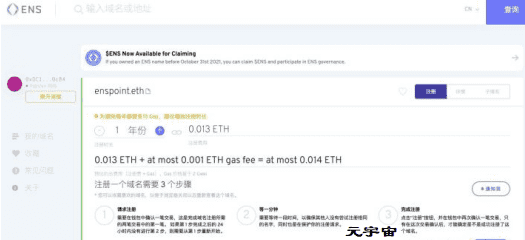
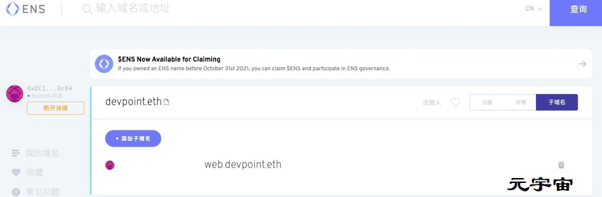
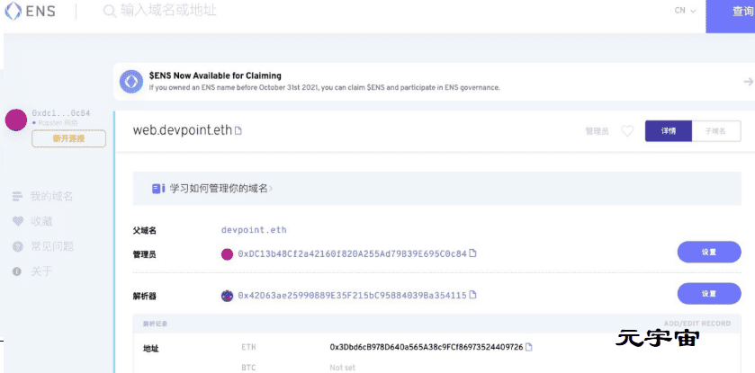
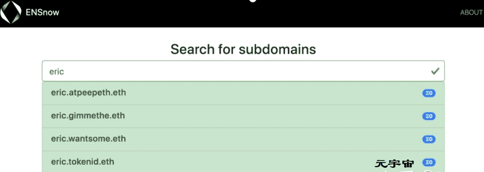

# 

# Radical

Radical 用最简单的方法，转换以太坊钱包地址为易于读取的 ENS 域名。目前获取 ENS 域名，需要你用一小时阅读相关技术文档，并且在 5 天内 6 次交易行为。使用 Radical Address 只需要一分钟，1 次交易行为。

以太坊域名服务是目前以太坊上最受欢迎的项目之一，这是有充分理由的。正如官网所介绍，“ENS 提供了一种安全且去中心化的方式，使用简单、人类可读的名称来处理区块链内外的资源。”

简而言之，可以为以太坊（或最喜欢的链）地址命名，这很像传统 Web 与 DNS 的工作方式。所有网站数据都托管在一个固定 IP 的服务器上，实际中没有人将这些数据放在浏览器中。

### 注册 .eth 域名

ENS 的核心功能是注册 `.eth` 域，在 ENS 上注册域时，需要牢记一些重要规则：

1. 最小域长度为 3 个字符。
2. 每年续订费用，3 个字符：`640 美元/年`，4 个字符：`160 美元/年`，5 个以上字符 `5 美元/年`。
3. 支持表情符号

### 创建和管理域

使用 ENS官网注册域非常容易。首先搜索想要的 ENS 名称。如果没有被占用（如果被占用，请前往 [OpenSea](https://link.zhihu.com/?target=https%3A//opensea.io/assets/ens) 并搜索它购买），如下。

ENS 官方网站注册域

在这里可以单击`请求注册`按钮，这将触发交易，等待 1 分钟，然后就可以注册名称。注册完成之后想要启用它提供的所有的功能就从域管理开始，如下图所示：

请求注册ENS

可以做很多事情，下面来看下有哪些信息并且可以设置哪些信息：

- **注册人**：可以设置并拥有管理权限的地址，并将可以将注册的ENS转让给其他人，信息展示的是最终的拥有者。
- **管理员**：可以设置指定一个拥有管理权限的地址，默认为注册人。
- **到期日期**：域名续订费到期时间，也可以在这里直接支付续费。
- **解析器**：处理解析下面的记录，例如与该域相关的以太坊地址。应该设置公共解析器，这将是单击“设置”按钮时的默认选项。
- **记录**：在这里可以将很多东西添加到域中，在这里放一个地址，这样当你把你的域名放在钱包里时，它就会指向这个地址。

在地址字段中设置以太坊地址后，它将在 MetaMask 等钱包中解析。如果将它指向一个 IPFS 哈希，可以在 `devpoint.eth/` 或 `devpoint.eth.link` 上为不解析 ENS 名称的浏览器提取域。

### 子域

子域为在 `.eth` 域之上构建提供了极大的灵活性。如果想为所有员工颁发 `devpoint.eth` 子域，很容易就可以做到。本节将介绍在拥有的域上创建子域以及允许其他人在拥有的域上购买子域的独特方式。

### 创建和管理子域

如果拥有 `.eth` 域并且只是想创建子域供自己使用，最简单的方法是通过 ENS 应用程序单击“**子域**”按钮，可以在此处添加新的子域。

设置子域后，它们的行为与主域非常相似，因为所有者可以控制它们并设置记录。这意味着像 `web.devpoint.eth` 这样的子域名也可以解析为地址和 IPFS 网站。

### 允许任何人在 .eth 域上声明子域

以上所有内容均由 `.eth` 域的注册人完成，可以设置子域并对它们拥有最终控制权的人，包括能够撤销它们。这对于希望完全控制子域的公司或个人来说很好，但是如果希望世界上的任何人都能够在自己的域上声明子域如何操作呢？

显然不想与他们协调，他们也不希望注册人能够撤销访问权限。好消息是有一个解决方案可以轻松地让在自己的域上开启子域的注册，甚至可以设定一个想卖的价格。

首先要将域控制权移交给 [ENS 子域注册商合同](https://link.zhihu.com/?target=https%3A//github.com/ensdomains/subdomain-registrar)。这意味着智能合约能够将子域分发给其他人，但不能再撤销对这些子域的访问权限。目前的步骤是相当手动的，但也很容易。

> 警告：这样做，将永久放弃使用域！将能够收取注册费、更改价格并将控制权转移给其他用户，但您将永远无法将您的域用于其他任何事情！

1. 加载 [.eth 注册商合同](https://link.zhihu.com/?target=https%3A//etherscan.io/address/0xfac7bea255a6990f749363002136af6556b31e04%23writeContract)，如果使用的是 Etherscan，则需要单击“连接 Metamask” 并从 Metamask 授权随后的对话框。
2. 找到 `approve` 功能。
3. 在地址字段中，输入 `0xc32659651d137a18b79925449722855aa327231d`
4. 在 tokenId 字段中，输入姓名的标签哈希，可以通过在 etherscan 上搜索姓名来查找此信息
5. 提交交易。
6. 加载新的[子域注册商合同](https://link.zhihu.com/?target=https%3A//github.com/ensdomains/subdomain-registrar)。
7. 找到函数 `configureDomain` 。
8. 在名称字段中，输入要列出的名称，不带 `.eth`（例如，“gimmethe”，而不是“gimmethe.eth”）。
9. 在价格字段中，输入新域的收费价格，单位为 wei。 `1 ether` 是 `1,000,000,000,000,000,000 wei`，因此例如要对每个域收取 `0.01 ether`，您应该输入 `10000000000000000`。
10. 在 refererFeePPM 字段中，输入您想为任何为您找到新用户的网站提供的金额。例如，要自己保留全部金额，请输入 0；要将其全部提供给站点，请输入 1000000。
11. 提交交易

现在域现已移交给子域注册商合同，如果设置了费用，任何时候有人注册子域，资金将被定向到原始所有者地址。这现在开辟了很多可能性！

### 在 ENSNow 上列出子域

ENS 团队已经建立了一个允许声明[子域的网站](https://link.zhihu.com/?target=https%3A//now.ens.domains/)。如果希望在此处列出所有子域，则该过程非常简单，具体步骤如下：

1. 转到此[页面](https://link.zhihu.com/?target=https%3A//github.com/ensdomains/subdomain-registrar)，然后单击右上角的 `fork` 。

2. 导航到 `app -> js -> domains.json`

3. 点击文件右上角的铅笔图标

4. 找到插入条目的适当位置（条目按字母顺序列出）。

5. 在条目中添加一个新行。如果在第 2 步和第 3 步中使用默认注册商，则应类似于`{"name": "yourdomain", "version": "1.0"}`。

6. 通过单击页面底部的“提交更改”来提交更改。

7. 点击 `Pull requests` ，然后点击 `New pull request` 。

8. 单击 `Create pull request`

   

   

   

   

