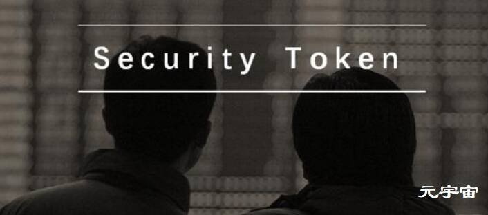

# 

# Security Token Network

Security Token Network 加速行业发展，针对证券型代币 Security Token 与区块链行业的市场进行调研分析，并为志向相投的初创公司提供 STO 服务。证券型代币以实物资产为基础，例如公司股权甚至是个人。通过赋予各种规模的公司所有权，通证化为每位投资者提供了机会。

ST——Security Token，近来在圈内的火爆程度与当下遭遇寒冬的资本市场，以及哀嚎遍野的数字货币市场形成了强烈而鲜明的对比。很多业内人士把ST的发行，即STO（Security Token Offering）当作合法的ICO，还有些人认为STO是Fintech第三次浪潮。

显然，在全球资本市场陷入萧条期的当下，需要一个全新的事物让行业从业者们振奋和慰藉。但是，如果仅仅把STO看作合法的ICO或者Fintech的某一次浪潮，并非不对，而是有些小瞧了它。

在我看来，Security Token 或许更伟大一些，它的问世在某种程度上是证券Token化的全球性金融实践，ST通过区块链技术产生的Token赋予证券全新的外在形式，并将由此赋予证券一部分全新内涵。或许，在未来，ST将颠覆现有的证券体系，并成为未来证券的重要组成部分，或者直接变身为超级证券。

**一、从井口往井下看，看到的只是井底；而从井口往上看，看到的却是整片天空。**

**以区块链的视角去看ST，那它只不过是证券化的通证，是区块链进入到3.0阶段的一种应用；但若是从证券的视角来看ST，那意味着传统证券借助通证这一区块链产物蜕变成未来的证券，使得资产证券化有了全新的载体。**

众所周知，证券的存在已经有几百年的历史。1603年，荷兰联合东印度公司发行股票进行融资的时候，或许并没有想到，他们创造了人类金融史上一次伟大的发明。此后数百年间，证券的内涵和外延不断扩展，所承载的功能愈来愈广泛。

我们知道，证券实质上是一种民事权利，且这种权利具有财产属性。权利的证券化，也是一种法律现象，即权利人行使权利的方式和过程用证券的形式表现。这种现象代表着投资资产符号化，同时也是随着社会发展，信用发达后的一种标志和必然结果。

正因为证券实质的这种特殊性，它必须依托于一定的表现形式。最初，荷兰联合东印度公司，作为第一个联合的股份公司，为了融资发行“股票”。人们来到办公室，在本子上记下自己借出了钱，然后公司承诺对这些“股票”分红。这就是最早表彰证券权利的基本方式——纸张，借助文字或图形在专用纸单上表示特定化的权利。

随着经济、科技的发展，依托于电子技术和信息网络的日益更新，证券已完成了由“有纸化”向“无纸化”的彻底转换，我们发现，投资者已经不再是拥有任何有形实物形式的证券，其所拥有的证券会在账户中以无形的形式被记载。现代证券在这种颠覆性的发展和转换下，带着与传统证券概念巨大的差异扑面而来。

不过，经过几百年的发展，证券市场也遇到了一定程度的发展局限。在资产证券化的环节，当前能够证券化的资产已经不能够满足现代人的需要，一些大宗商品、无形资产（比如著作权、股权、理财产品、债权）等，在现有的证券体系内，很难做到证券化并进入流通领域。在交易环节，更是受到诸多的限制，比如交易时间受限，交割及清算时间延迟，监管的复杂性导致流动性降低等等，再加上每一个维度都有众多的监管组合和管理交易的多个监管机构，严重降低了证券的流通。

也就是说，当前的证券体系已经不能充分满足人们对证券的需求，对资产证券化的期许。在这种情况下，应运而生的Security Token，给了证券进一步进化的机会。

**二、可口可乐最初发明出来的时候是一款治疗头疼的药剂，而如今的它却是碳酸饮料的鼻祖，风靡世界。**

**被誉为第四次工业革命的区块链，近来成为全球瞩目的新兴产业，但场景应用的落地问题始终困扰着行业从业者、资本市场以及监管机构。事实上，ST的出现，不仅解决了区块链场景应用问题，更为现在的证券提供了新的出路。一方面，作为区块链天然产物的Token，为当前的证券提供了全新的载体；另一方面，分布式存储、公开透明、不可篡改等区块链特性，则为ST这种新的证券形式注入了鲜明而现代的内涵。**

诞生于2017年的ST，开始只是在美国受到SEC——美国证券交易委员会，严密关注的区块链Token产品，它受到瞩目的焦点也在于是应该被豁免还是被纳入证券体系，而那时的瞩目者更多的是币圈人士和一些对区块链有所好奇的华尔街资本大佬。

倘若如此的话，那ST只是从井口看到的井底，或者还是药剂时候的可口可乐。然而科技的发展其实并不由着人的主观愿望。当从业者们不断地开始演绎ST的用途，完善它的模型后发现，它与证券天然匹配。

区块链的特性——公开透明、分布式存储、不可篡改等，使得ST可以完美地帮助现在的证券体系进行进一步进化。

首先，它可以以Token为载体，以区块链为依托，将任何资产（有形资产+无形资产）进行证券化。相关数据显示，全球股票资产价值约70万亿美元，债务约100万亿美元，房地产约230万亿美元（其中住宅约180万亿美元，商业32万亿美元），但更多的资产还并未证券化，比如版权、艺术品、古堡、豪宅等等，现有的证券体系显然无法对它进行证券化，而ST则毫无问题。

其次，它可以有效地解决流通问题。一方面，Token化可以使整个交易更加便捷，跨境流通完全不是问题，7*24小时、交易即清算、T+0等等都是现有的证券体系所不具备的。另一方面，区块链的属性可以将资产切割为微小颗粒，这同样是现有证券所不具备的。用Habor首席执行官 Josh Stein的话说就是，“锁定资本，而不锁定投资者”，这大大降低了投资门槛。未来，即使像蒙娜丽莎这样的稀世珍品，一旦被证券化之后，每个人都可以成为这幅画的潜在股东，并能够随时将手中份额有效流通。

再次，它可以让监管变得相对容易。哈耶克 的《通往奴役之路》有一句经典话语，"如果一个人不需要服从任何人，只服从法律，那么，他就是自由的。" 区块链属性的协议层面自动化管理在某种程度上意味着代码即法律。各个国家对待区块链的态度不尽相同，并不影响ST本身自带的约束属性。

**三、一只南美洲亚马逊河流域热带雨林中的蝴蝶，偶尔扇动几下翅膀，可以在两周以后引起美国得克萨斯州的一场龙卷风。**

**当区块链的Token赋能证券之后，无疑打开了金融创新的巨大空间。正如多年前，由数据的交换协议衍生出Facebook、YouTube、微信，彻底颠覆了我们的生活方式一样，Security Token提供的可编程监管和交易逻辑，将为证券的发展开拓出新的道路，而这条路或许可以缔造一个未来的超级证券体系。**

一个现象或许可以佐证我的观点，就是ST的参与者从最早的币圈人士，慢慢传导到主流区块链从业者，直到传统的资本市场的巨头。

我们看一下，最初STO的那些公司，基本上都名不见经传，直到9月11日，区块链领域的巨无霸以太坊进来了。开发者Stephane Gosselin在GitHub提交了一份新提议，公布了一项新的证券型Token ——“ERC1400”，新标准主要是把 Token 的互换性（fungible）结合证券相关的业务场景，设计了一套通用接口。新Token提案主打监管功能，目的是方便用户以合法合规方式在以太坊网络发行证券。

紧接着是美国巨型交易所运营商纳斯达克（Nasdaq）。据报道，纳斯达克正在策划一个专门用于代币化证券的新平台，此举将使项目能够在受监管的环境中提供STO，以符合美国法律。报道表示，纳斯达克正在与区块链公司Symbiont进行谈判，以创建自己的平台，使标记化证券能够上市和交易。虽然消息的真实性还有待考证，但是纳斯达克对STO的态度始终颇为暧昧，拥抱和纳入之心昭然若揭。

可以想见，传统资本的力量介入之后，整个ST的生态将得到极大的改变，融合了创新性区块链公司、区块链领域巨头和传统证券巨无霸的ST，将会迎来什么。尤其值得注意的是，与传统资本市场不同，ST天生具备区块链国际化的特性，它面向的是整个全球资本市场，那么其聚集的人才、资金、创造力将远非过去单一体制内的证券体系可比，可以想见，一个超级证券体系已经具备了打造的条件。

当然，在巨大的利益驱使下，各国政府也态度不同，所以监管政策也差异颇大。就目前来看，还没有一个国家放宽有关发行证券类Token的证券法；但我们也应该看到，也几乎没有国家愿意错失对证券体系进行更新换代的这次机会。其实，反过来想，各国监管政策的难产也是利益攸关所必须的审慎。

纵观历史，每每都是科技发展推动经济、倒逼政策，我相信ST就是代表了未来的证券，或者起码是未来证券体系中的重要组成部分。因为，只有实现ST产品融资合法化，才能对标现实资产，开发更大潜在市场，而这是造福全人类的科技创新，没有理由被扼杀掉。

