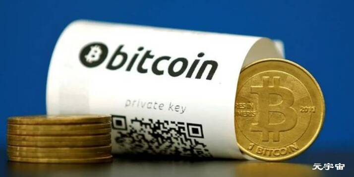

# The Stablecoin Index

The Stablecoin Index 稳定币指数，是由 Myles Snider 与 Mike McDonald 合作的开源工具，用于跟踪和比较各种稳定币项目。具体列出按市值排名的实时、公开交易的稳定币数据，以及价格、交易量等。

1 . Colonial Pipeline公司使用加密货币支付巨额赎金；据金十消息，据两名知情人士透露，Colonial Pipeline上周五向东欧黑客支付了近500万美元，而本周早些时候的报道称该公司无意支付勒索费，以帮助美国最大的输油管道恢复运营。知情人士称，网络攻击发生后数小时内，该公司就用无法追踪的加密货币支付了巨额赎金，突显出该公司面临的巨大压力。收到这笔钱后，黑客就向该公司提供了一个解密工具来恢复计算机网络。一位熟悉该公司工作的人士说，该工具速度非常慢，以至于管道公司继续使用自己的备份来帮助恢复系统。

2 . 韦氏评级发推称：BTC不需要特斯拉、Elon或任何其他CEO来推广。比特币是去中心化的全球价值网络，它引发了加密革命。这场革命将永远改变我们的经济、金融和政治格局，即使是CEO也难以应付。

3 . 机构分析：据金十消息，机构分析显示，比特币跌回到50000美元以下，很多人将其归咎于马斯克的言论转变。但是，比特币下跌还有更多原因。具有讽刺意味的是，比特币下跌是在美国通胀数据大幅上升后发生的。比特币爱好者声称加密货币是潜在的通胀对冲工具，但实际上，并没有量化证据可以证明实际利率或盈亏平衡通胀率跟数字货币有什么联系。相反，比特币属于高风险资产，是受人们对它将得到大规模采用和未来用途的希望所驱动，而这一切都还是未知。这让它更像是科技初创公司的股票。

4 . ADAM聘请美国前财政部官员为数字资产市场制定实践政策；据The Block消息，数字资产市场协会（ADAM）聘用了美国前财政部官员Robert Baldwin作为其政策负责人。在财政部任职期间，Baldwin参与了金融犯罪执法网络(FinCEN)加密钱包提案，还参与了总统工作组关于稳定币的声明。ADAM首席执行官Michelle Bond称：“通过与我们的成员合作，我相信我们将制定出有利于公平、有序和高效的数字资产市场的最佳实践政策。”

5 . CoinDesk消息，日本区块链艺术公司Startbahn完成1000万美元的B轮融资，将为其Startrail区块链的发展提供资金。该平台还使用NFT等技术提供艺术品的可追溯性。本轮融资由投资公司Miyako Capital和Edge Capital领投，Miwa Taguchi、OPS、SX Capital、TBS Innovation Partner、iSGS Investment Works等参投。

6 . 据FinanceMagnates消息，Cardano上的DeFi平台deFIRE周四宣布，已在即将进行的IDO之前完成了500万美元的融资。Axia8 Ventures，Lotus Capital，Hype Partners，Moonwhale和Newtribe Capital等参投。

7 . Mogo将以4860万美元的价格再次收购Coinsquare交易所17.1%股份；据CoinDesk消息，加密货币交易所Coinsquare周四宣布，数字支付和金融科技公司Mogo将从美国上市矿企Riot Blockchain手中购买220万股Coinsquare普通股，并从现有投资者手中购买320万股的期权。此次收购将使Mogo的持股比例从19.9%提高到约37%，收购成本达4860万美元。此次普通股收购预计将于本月晚些时候完成，期权交易将于6月初完成。

8 . 跨链项目KIRA Network宣布与Clover Finance达成合作；据官方消息，跨链项目KIRA Network宣布与波卡生态智能合约平台Clover Finance达成战略合作伙伴关系，旨在实现非托管跨链质押。通过在KIRA和Clover之间建立一个跨链资产桥接，任何在Clover平台上发行并可通过其访问的数字资产将能够通过在KIRA进行上质押来获得收益。由于所有在KIRA上质押的资产都保持流动性，它们可以在许多不同的链上被进一步利用，以实现杠杆化质押和杠杆化收益耕作。

据介绍，Clover允许以太坊开发者和项目将他们的合约迁移到Polkadot。通过最小化在新网络上运行现有Solidity智能合约所需作出的变化，以太坊项目可以简单地复制他们的dApp，并使用MetaMask、Truffle、Remix和其他熟悉的工具将其部署到Clover。

9 . 银河数码CEO：据U.today消息，银河数码CEO麦克·诺沃格拉茨（Mike Novogratz）在《纽约杂志》（New York Magazine）的最新采访中透露，加密货币现在占其总净资产的85％。

\10. 据cryptoslate消息，来自去中心化金融（DeFi）巨头Chainlink，Aave，Sushiswap以及其他几个加密项目的22位开发人员和高管加入了由分布式分类帐网络Radix创建的非营利组织GoodFi。这家非营利组织希望在2025年之前将1亿人带入到DeFi领域。

\11. 据官方消息，基于Layer2的匿名交易协议、公平游戏平台ZKCHAOS宣布以高超额认购完成种子轮和战略轮融资，两轮融资总额为150万美元。此次融资由NGC Ventures和Spark Digital Capital领投，其他战略投资者包括3 Commas Capital、Prometheus Labs、Moonwhales Ventures、Kyros Ventures、Morningstar、Particle、Ape Capital、Ruby Capital、AU21 Capital、X21等。

\12. 灰度比特币信托溢价跌至历史最低点，达-20.48％；根据加密货币数据追踪器YCharts的数据，GrayScale Bitcoin Trust（GBTC）的溢价在5月13日降至-20.48％。这是Grayscale旗舰产品的最低点。

\13. 彭博社：据彭博社报道，加密货币交易所币安据报道正面临美国国税局和司法部的调查。根据这份报告，美国司法部和美国国税局的官员“引用了对Binance业务有洞察力的个人信息”，并引用了未透露姓名的消息来源。彭博社的报告指出：“联邦机构没有指控币安做错事。”

\14. 英国央行行长贝利：据金十消息，英国央行行长贝利：数字货币将对利率设定产生影响。数字货币还需要几年时间 ，隐私是数字货币的一个大问题。

\15. 据金十消息，英国央行行长贝利：如果有理由使用数字货币，我们将采取行动。

\16. 何一回应：针对“币安将接受美国司法部和国税局的调查”，币安高管何一在社群回应称：币安美国是独立运营的，谢谢关心。

\17. 何一进一步回应：针对“币安将接受美国司法部和国税局的调查”，币安高管何一在社群进一步回应称：“币安不支持美国用户交易，币安美国是合法持牌、独立运营的公司。谢谢关心。”

\18. 据金十消息，美联储理事沃勒：美联储正在央行数字货币方面花时间，目前还不清楚它将要解决的问题。

\19. 币安CEO：币安CEO赵长鹏发推特表示，币安正与执法机构合作打击不良玩家。

\20. Pantera Capital：这可能是一个买入比特币的机会。比特币可能在未来5到6个月翻一番。

\21. 据金十消息，Pantera Capital：特斯拉CEO埃隆·马斯克对比特币的看法是有道理的；还有其他的区块链。

\22. V神捐SHIB币后，印度最大加密交易所WazirX宣布上架SHIB币；据CoinDesk消息，Buterin（V神）的（SHIB币）捐赠引起了印度主流媒体的广泛关注，总部位于孟买的印度最大的加密交易所WazirX随后宣布上架SHIB币现货交易，币安为WazirX的最大股东。本周初，总部位于孟买的CoinDCX交易所也推出了SHIB对的现货市场。

\23. 币安受到美国当局调查 洗钱和税务探员展开走访；据金十消息，美国司法部和国税局正在对币安展开调查，知情人士称，作为侦查行动的一部分，负责调查洗钱和逃税行为的官员约谈了了解币安业务内情的个人。跟它所处行业一样，币安也基本不在政府监管范围内。区块链取证公司Chainalysis Inc去年认定，在其检查的交易中，与犯罪活动有关的资金更多选择币安进行交易，超过其他加密货币交易所。Chainalysis的客户包括美国联邦机构。对此美国司法部和国税局的发言人拒绝置评。

\24. 灰度CEO：据彭博社消息，灰度CEO表示，转换为ETF可以解决很多灰度比特币信托（GBTC）的问题。他认为，ETF是最大的加密货币基金困境的解决方案。

\25. 据U.today消息，欧洲最大的音乐节之一，Exit音乐节已经开始接受比特币付款。只需在Exit网站上选择“使用比特币付款”选项，然后扫描QR码即可进行交易。

\26. 印度主流板球队加入粉丝代币平台Socios.com；据decrypt消息，印度主要的板球队皇家挑战者班加罗尔，加尔各答骑士和旁遮普国王队都加入了（体育）粉丝代币化平台Socios.com。Socios.com由区块链初创公司Chiliz开发，是一个基于以太坊的平台。它利用区块链技术为世界领先的体育组织提供了与全球粉丝群互动并从中获利的工具。作为回报，Socios允许粉丝令牌持有者在民意测验中投票，获得VIP奖励，参加俱乐部和赞助商促销活动，以及访问启用了AR的功能，聊天论坛，游戏和竞赛。

\27. 彭博社策略师：据CoinDesk消息，彭博大宗商品策略师麦克·麦格隆（Mike McGlone）表示，埃隆·马斯克（Elon Musk）对比特币可能对环境不利的担忧不足以使该加密货币的价格进一步上涨的潜力脱轨。特斯拉（Tesla）暂停使用比特币的购买，这并没有震动我们的论点，即在加速数字化和电气化的世界中，加密货币正处于早期的价格发现时代，正在成为全球数字储备资产。比特币仍然值得买入。

\28. 财报显示，Coinbase第一季度净利润7.715亿美元。预期7.3-8亿美元。

\29. 美股收盘：三大股指均收涨，道指收涨1.29%，纳指收涨0.72%，标普500指数收涨1.22%。美股区块链板块收跌3.16%。Marathon Digital、Riot Blockchain、嘉楠科技、亿邦国际均跌超10%，Coinbase跌6.53%。

\30. 据Coinbase一季度财报，该公司将MTU（每月交易用户）的年度预测范围从先前的400万至700万预测范围提高到了550万至900万。现在的每月交易用户（MTU）为610万。

\31. 马斯克：特斯拉CEO埃隆·马斯克发推称，需要明确的是，我坚信加密货币，但它不能推动化石燃料的使用，尤其是煤炭的使用。

\32. 据金十消息，加密货币交易所Coinbase CEO：本周在华盛顿与政策制定者进行会面。

\33. 数据：CoinATMRadar统计数据显示，5月1日以来，全球共新安装了494台比特币ATM。截至目前，比特币ATM机在全球的部署数量已达19800台。

\34. 财报显示，量化基金Renaissance Technologies（即文艺复兴科技）在第一季度提高了对加密货币生态系统的投资，积累了有史以来最大的加密矿业股票头寸。截至3月底，其持有的矿业股票总价值超过1.4亿美元。其中1160万股的Riot Blockchain（6180万美元），156万股Marathon（7500万美元）和203672股嘉楠科技（420万美元）。

\35. 马斯克：特斯拉CEO埃隆·马斯克发推表示，正与狗狗币开发人员合作以提高交易效率。潜在的希望。

\36. 据金十消息：韩国最大的搜索引擎和门户网站Naver将参与韩国央行数字货币项目。

\37. 灰度LTC、LINK等币种，LINK持仓增长1.06%；据币世界数据，美东时间5月13日，灰度信托持仓数据变化如下：灰度LTC信托持仓量增加90.83枚（+0.01%），总持仓量为1503861.71 LTC，LTCN溢价率941.24%；灰度LINK信托持仓量增加1808.79枚（+1.06%），总持仓量为172808.08 LINK；灰度ZEC信托持仓量增加50.80枚（+0.02%），总持仓量为327036.58 LINK。灰度BTC、ETH、ETC、BCH、BAT、MANA、FIL、LPT信托当日未增持，GBTC溢价率-21.23%、ETHE溢价率-14.34%、ETCG溢价率-46.55%、BCHG溢价率160%。
