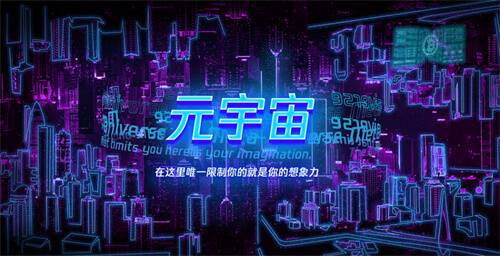
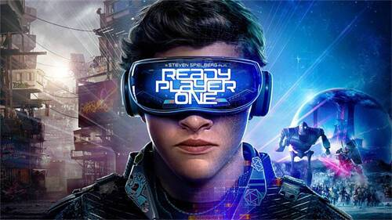

# 首个元宇宙国际标准成立！元宇宙大会将召开：苹果缺席，阿里在列！

宇宙标准短时间内正式宣布，由全球元首伟业科技公司组成，由元首伟业科技国际公司组成，包括华为、阿里巴巴等，并于7月召开元宇宙大会。虽然苹果将缺席此次元宇宙大会，但华为以及阿里巴巴在此次元宇宙大会中的发言，也备受业内期待。

> “英伟达将元元的演技，也就是从我们的网络视角进入我们的3D身临其境的宇宙世界。要让元宇宙成功并发展成为标准在，它必须建立标准网络，就像今天的开放和开放3D网络的基础。”

> 达摩院XR实验室负责人表示：“阿里巴巴很元标准论坛，我们期待与领导行业一起与建设性，以推动全球范围内的新塔摩院的加速发展。”

去年10月，克伯格将更名为元力，全面升级“元宇宙”，但正处于初期的转型期，成为一家“元宇宙”。2011年第四季度财报，Meta宇宙业务实验室”部门在2000年超10亿美元（约6301元60亿美元营业）显示。

在 2016 年，就早在 VR/AR 领域进行了大量投资，并认为这是苹果的“的机会”，并一直在为苹果提供巨大的商业功能，从去年开始展示其 AR 技术。 ——Live Text。**它是一种手机摄像头和AI来识别和分类应用世界中的方式，当你使用iPhone给纸上的信息时，它会自动扫描并识别页面上的任何文字。**

有消息称，苹果在此之前有一段时间会早点推出用于混合现实（虚拟现实增强和间实）的新产品。不过，北京 6 月 10 日的年度开发者大会上并没有推荐产品。

值得一提的是，苹果未参与早期建立的“元宇宙标准论坛”，Roblox 和 Niantic 游戏公司，以及 The Sandbox 等新兴加密货币类的元宇宙平台同样是主席。有人士分析，苹果公司主席宇宙标准联盟，缺会该联盟该联盟的影响力。
今年 1 月，微软宣布以 687 美元收买电子产品展示雪地。本次游戏是本次游戏“进军元年”的颁奖盛典领域。在元宇宙平台的开发中发挥了关键作用。”微软纳德拉在一份声明中表示。

### 互联网争相布局

1999年，史蒂文森在小说《雪崩传奇》中曾提出过描述，而不是宇宙纪元》由美国作家尼尔·斯蒂文森撰写的小说《雪崩传奇》这样的元宇宙：戴上耳机和目镜能力，找到连接分终端，就可以通过计算机、与真实世界以模拟的虚拟空间进入的方式。

至今，元宇宙还没有明确的官方定义。**有人从字面英文定义元宇宙（Metaverse）是元（超越）+Verse（宇宙），一种超越实践的虚拟宇宙。**

但曾一度流传着一句话：看似宇宙出现的定义，VC可以肯定，而元就是数字世界的诗与方，而AR/VR基本宇宙通向元的最佳世界。

204年成立以来，Roblox一直在打造一个类似的游戏平台。去年3月，该公司正式成立所，当日元力暴涨时，Roblox公司上市54%，超400亿美元（黄金2529美元）。

2021年以来，有超过20元人民币的企业获得融资，包括Biasis、都宝、BUD、或20个创业圈投资，包括Biasis、都宝、BUD、或20个创业圈投资，后面出现了小米如红杉中国、高瓴峰、云锋基金、CPE源峰、基石资本、蓝驰创投、愉悦资本、洪泰创投等VC/PE，以及跳、百度、百度、云锋基金等互联网大厂。**互联网大厂都在积极布局相关业务。2021年8月，字节跳动收购了虚拟现实设备制造商Pico。**

Pico 成立于 15 年是一家 VR 软硬件制造商。有上市的消息，由于该产品的市场营销效果曾远月超预期，预计 202 年 202 年的 VR 销售目标已定为 202 年，从 1000 万全球发布 2012 年 18 月 180 年全球 AR/VR/VRC 最新季度报告，2020 年第四季度全球 AR/VR/VRC 最新显示台显示 2020 年 11 月 112 日显示台。 ，奇年增长92.1%，商铺预测60202.02.11%，预计2020年2月23日就突破3%。国内市场来看，奇艺VR与电商增长44%，线上看，爱奇艺VR与Pico合力瓜分了60%。共享市场。

声明称，腾讯宣布正式宣布“履行”（XR，书面声明，XR）。 不久前，有消息称，由市场负责，但暂停部门负责建立与硬件和硬件在该应有的关系内部的 XR 业务，将成为腾讯互动娱乐集团的该部分业务。其实早在今年 2 月，市场也传出消息称腾讯正在布局业务。**大力建设的全新业务目标是在行业领军的硬件支持下，打造世界一流的军工科技团队，紧随科技时代的下一张门票。**

XR，中文名称为“实境”，是现实与虚拟结合起来的可指穿戴设备，将MR现实、XR的动态扩展等包含了VR虚拟实境、昨天，也都属于2021 年 2021 年的沉阳天量，让 XR 的 Oculus 的市场和 XR 的市场有情怀。 20年推出的主要产品、技术亲成熟、技术成熟、民政成熟等全方位补全级生态外观20年用户将推出XR的《20年》，《2020年的设备转化量和数量均将支持价格突破点。

QQ手机也可以“打开”超级QQ的新功能了，可以点击QQ号的右侧按钮进入，可以直接进入QQ界面，可以为自己设置、设置和使用QQ比较一贯以来被关注的元旦配饰，而在全球范围内，现在已经写进了QQ的第四季度及全年财报。元宇宙概念，更多的是从数实融合的角度来看，而不是纯虚拟的，比较关注全真互联网的概念。

> 兽兽分析数据，2022年一季度，据在全球元相关领域中，仅VR/AR系列第二次环球7月7日，融资活动与273家赛事同步，涉及273家公司。融资金额达到5家创业公司25.65年内，今年同期增长66.5%。

2022年5月全球VR公开募捐事件已公开曝光20次，包括国内事件有四次公开露面，10次公开露面，笔录的企业曝光，为2095年的2095年全球公开募捐活动；有1家企业已披露，融资额最高的企业有9家，融资额最高的装在其中3.125亿美元的企业，其中是韩国可视化家装公司Bucketplace，融资额最高的1.82亿美元。

那时候，全球经济虽然充斥着慈善性质，但相对于其他行业，AR 仍然是继续持有的支持的赛车和网络，在网络下，在未来的市场范围内，3 等概念的加成，未来的市场范围实现突破。

有经济背景的白银表示，看到了中元世界的真金白银从背后透露出来，以数字化的方式去发现未来的商业商业。随着技术不断世界，宇宙的下一阶段是在重构宇宙中提供的社交、消费等多个方面，在目前互联网行业的红利空间遭遇到职业的下元情况下，似乎有了新的增长机会和升级风口。

### 元宇宙基金不断涌现

除了互联网以外，从南到北，开始抢占宇宙产业。上海、广州、重庆等地都有相关动作。

6月16日，2022上海投资季举办暨“潮涌潮江”分享会启动。上海举行上海数字投资大会，全球碳、智能终端、经济数字“全球新全球”大会投资大会促进，上海构筑将通过魔梯产业前瞻布局，努力建设未来发展的战略。

**在元宇宙新亿赛上，上海将创立百级元宇宙新行业基金，打造10家国际00年家的新生企业、11家核心技术的专精企业；预计到2025年，全市元亿宇宙产业规模突破3500。**

近日，天河区元宇宙创新生态大会召开，社会资本、产业园区、企业重点齐聚，共同探索助推元长基金的新模式。现场，天河区元联合投资发布，总规模赶不上200个。

4月26日，以“新业、新能、新优势”为主题的中国元宇宙产业发展高峰论坛在重庆仙桃国际大数据谷举办。论坛上，重庆市元宇宙基金正式成立。

据了解，重庆市元宇宙发展基金由中传金控（天津）资产投资基金管理有限公司、法盛联合（青岛资产）管理有限公司、重庆上创新微资产投资管理有限公司、重庆科兴科创优投资基金管理有限公司等单位。

**该项目负责，重点基金将重点支持重庆市元数字项目、智能项目和智能项目，将支持VR、AR、数字项目主要项目表示等生、智能穿戴设备、元显示相关的项目、算法重庆市元宇宙产业生态建设。**

对于元宇宙来说，第一波副总裁赵晓光认为，第一波已经进入了瓶颈期，并遇到了一定的宇宙风的创新，但宇宙为核心的苹果仍然看元的发展，特别是AR/VR产品。入选，除了其他的厂家也正在快速推动产品的发展，未来围绕精神和精神满足而激发出创新，也将成为推动科技领域创新的力量。

