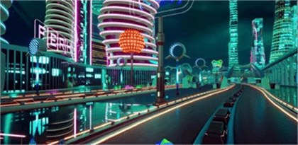

# 全球元宇宙大会新闻发布会召开！共建共筑元宇宙人类数字命运共同体

底层技术是元宇宙实现产业革新的重中之重，产城融合是元宇宙赋能实体经济的高维手段。2022全球元宇宙大会产业与城市论坛暨全球元宇宙大会新闻发布会将以“元起·眺望· 觉醒·开化”为题，献上科技革命与文化觉醒的激情碰撞，带来技术演进与产城融合的发展变革，汇聚元宇宙产业链龙头企业打造产城融合样板案例，旨在助力实现城市产业转型升级，共建共筑元宇宙人类数字命运共同体。

> 2022全球元宇宙大会产业与城市论坛暨全球元宇宙大会新闻发布会
>
> 会议时间：6月30日-7月1日
>
> 会议地址：线上
>
> 主办单位：中国移动通信联合会
>
> 联合主办：上海市通信管理局
>
> 国际合作：欧盟创新中心 GSMA 5G IN
>
> 学术合作：复旦大学国家智能评价与治理实验基地、元宇宙与虚实交互联合创新中心
>
> 战略合作：中国电信、中国移动、中国联通

**元起：元宇宙，跨越三十年的狂想曲**

三十年前，尼尔·斯蒂芬森在他的小说《雪崩》中创造了一个并非以往想象中的互联网——元宇宙（Metaverse），它是和社会紧密联系的三维数字空间，与现实世界平行，在现实世界中地理位置彼此隔绝的人们可以通过各自的“化身”进行交流娱乐。

而稍早于此的1990年，钱学森先生就曾在信件中给 VR（Virtual Reality） 取名为“灵境”，还对灵境做了展望与期待，在这份远大的设想中，多处与元宇宙的理念不谋而合。钱老曾在给中国工程院院士、计算机专家汪成为的信中如此写道：“我对灵境技术及多媒体的兴趣在于，它能大大拓展人脑的知觉，使人进入前所未有的新天地。新的历史时代要开始了！”　

**眺望：技术演进带来社会革新，而元宇宙远胜过往**

从互联网到移动互联网，带动人们消费、工作、政务、娱乐、社交、文旅等生活方方面面的巨变，仅仅是移动通信+互联网为社会发展带来的动能已经强大如斯。元宇宙融合了广义互联网（云计算服务、IDC、边缘节点、5G/6G、数据库等）、物联网、区块链、交互技术（实时通信、在线渲染）、人工智能（AI）、游戏（引擎、开发）等六大科技动能，它所带来的社会发展推力已然不是单纯依靠做加法就能够估量的。

作为一个“平行复刻的数字世界”，元宇宙将大幅提高数字化生产力，同时影响现实与元宇宙世界，由实转虚，又由虚化实，以一种“颠而不覆”的方式，改变我们未来的生活为社会各个领域提供全新的发展空间，为每个个体的发展提供新的道路和可能，为人类文明的书写提供更宏伟的纸张。

**觉醒：名为数字人格的第二人生在凝聚成型**

历经互联网阶段，网络身份、角色扮演游戏、虚拟主播等现象和事物的背后，“数字人格”正在不断觉醒。元宇宙，突破传统社会的边界，跨越时间与空间的障碍，与人类社会全面融合又相对独立，人也将不仅具有生物属性、社会属性，数字人格将被最终确立，身份和人格同时存在于元宇宙和现实之中，数字人格成为人格权利的有机组成部分。

元宇宙带来的人类觉醒，是一次对于人类属性的再定义，这种再定义一方面为个人的人生带来了全新的机遇和改变契机，另一方面，人类的新觉醒，也将让消费、工作、政务、娱乐、社交、文旅等社会的方方面面觉醒新的属性，其中潜藏的新赛道、新商机是无限的。

**开化：这是一场属于元宇宙的“启蒙运动”**

三十年后，“元宇宙”正式登上时代风口，Facebook、微软等国际巨头抢先入局，国内三大运营商携腾讯、字节等互联网巨头也紧随其后，不断将元宇宙上升为企业核心战略，在风起云涌的元宇宙浪潮中抢占先机；与此同时，“元宇宙”作为中国经济发展实现“换道超车”的全新机遇，受到国家高度重视，包含北京、上海、广州等城市在内的全国12个地区纷纷开启了元宇宙产业布局，上海市、安徽省将元宇宙列为“十四五”规划重点新兴业态创新工程，其中上海市更是提出了遵循“虚实融合、由软带硬、由平台到生态”的总体思路，打造赋能千行百业的产业创新体系；可见，全世界元宇宙发展决心愈加显著，‘元宇宙时代’正式到来。

元宇宙，不是单纯的一件产品、一个解决方案或者一款游戏，它从孕育到诞生，不止需要六大科技动能共同推动，更需要一场从思想到技术的洗礼和开蒙。

2022年6月30日，全球元宇宙大会新闻发布会将掀起一场属于元宇宙的“启蒙运动”，激发元宇宙历史人文与科技的碰撞，释放元宇宙数字虚拟新价值，共创元宇宙发展共识，发掘中国元宇宙全核心力量，拓展元宇宙无穷创新边界，树立以“钱学森思想”为指导的中国元宇宙文化骄傲，让中国元宇宙产业立足中国、放眼世界，角逐元宇宙产业新赛道，推动实体经济与数字经济深度融合，共建共筑元宇宙人类数字命运共同体！

