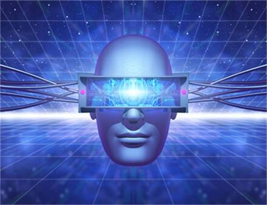
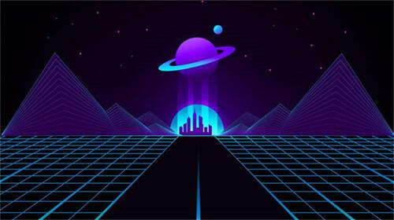

# 首届元宇宙大会召开时间 全球元宇宙大会举办地点

关于元宇宙的话题持续火热，元宇宙大会、元宇宙虚拟人、元宇宙游戏等方面都有新消息。本期元宇宙观察日报，继续会大家带来有关于元宇宙的最新动态。

**全球元宇宙大会“星火燎原”点亮计划将发布**

6月30日-7月1日，全球元宇宙大会“星火燎原”点亮计划暨2022全球元宇宙大会新闻发布会将线上召开，通过“星火燎原”计划发布首批节点城市，点亮一省一市一县一镇，汇聚当地元宇宙龙头企业打造产城融合样板案例，旨在助力实现城市产业转型升级。

另外，还将举办元宇宙文旅创新论坛、元宇宙产业生态袖论坛、元宇宙虚拟数字人论坛、全球分布式云大会新闻发布会、元宇宙云游戏论坛、亚太OTT/IPTV大会新闻发布会、元宇宙文娱论坛、元宇宙数字营销论坛等。

**动漫公司探路元宇宙：中影年年虚拟数字人代言映宇宙创新多元应用场景**

6月15日的映客品牌升级发布会上，映客互娱正式更名为“映宇宙”，中影年年为映宇宙定制的虚拟数字人“映映”作为其虚拟代言人在发布会上与大家互动。中影年年在三维数字IP领域深入技术研发、项目孵化10余年，而今结合元宇宙趋势与前沿技术让数字人有了更加多元的可能。在此次映宇宙发布会中，代言人“映映”就是中影年年用自身研发的AIBox平台打造的一位虚拟数字人。

中影年年利用自身多年来在塑造精美3D角色方面的经验和对Z世代用户群体偏好的洞察，创造出受欢迎的数字人形象。在人物创作和生产流程上，中影年年通过自主研发的AIBox最先进的AI智能角色生成引擎，打造出了受用户欢迎的数字角色；在技术方面，中影年年依托自主研发的AIBox对人物表情、真实毛发、实时动力学、肢体动作等进行智能实时驱动处理，让映映表情更加生动、自然。

**Adobe发布Substance 3D工具更新，支持元宇宙内容创建**

Adobe公司宣布推出3D内容创建工具Adobe Substance 3D更新，旨在提升沉浸式体验并推动元宇宙创新发展，包括SubstancePainter、Designer和Sampler原生支持Apple M系列芯片可以帮助3D内容创建者更高效地创作；允许开发人员编辑插件，支持在其他应用程序中使用Substance 3D素材以及模型引擎等，Adobe还将在今年下半年发布Substance 3D Modeler，将功能扩展至3D雕塑工作流程。

**郑定向会长：元宇宙的发展与创新，正引领着我们奔向未来世界**

由深圳市科学技术协会、深圳市互联网行业联合会、福田区工商业联合会三大协会联合指导，深圳市信息服务业区块链协会主办，开普勒总赞助，腾讯云、深圳职业技术学院元宇宙创新中心、热链文化传媒、FPA全球联盟、七级宇宙联合主办、NFtea数字茶票协办，华为云特别支持，链上荞酒、美幻艺术赞助的“第二届湾区元宇宙大会”正于深圳朗廷酒店进行中。在大会进行过程中，深圳市信息服务业区块链协会会长郑定向为本次元宇宙大会的核心主旨“数字永生，造未来之势”做出发言。郑定向会长表示：

> “元宇宙的发展与创新，正引领着我们奔向未来世界。一个全新的宇宙与未来正在成为现实，而本次大会的数字代言人“正经姬”将为实体产业的发展，为乡村振兴的数字化发展而赋能。”

本次元宇宙大会将汇聚“元宇宙风口”，在数字造势时代探寻未来进化之途。

**元宇宙沙盒游戏平台 Roblox 或将登陆 Meta Quest 2**

据 Bloxy News 近日在社交媒体上披露，元宇宙沙盒游戏平台 Roblox 或将登陆 Meta Quest 2。Bloxy News 在推特上写道：“准备好以一种全新的、令人身临其境的方式体验元宇宙吧。Roblox 很快就将正式登陆另一款设备……有人能猜到它是什么吗？Bloxy News 在推文配图中使用了 Roblox 和 Oculus 的徽标，图片下方还添加了“Meta Quest”的标签。但截至目前，Meta 官方还没有对这一传闻发表任何评论。

**虚拟人梅涩甜担任北京国际电影节元宇宙推介官**

第十二届北京国际电影节 6 月 19 日宣布，虚拟人梅涩甜担任电影节的元宇宙推介官。根据梅涩甜的公开信息，其于 5 月 30 日全国科技工作者日出生于元宇宙，目前活跃在知识科普、脱口秀表演、时尚生活、文艺创作等领域，主要作品包括《梅得说》脱口秀系列和《梅得说》读书系列。

**上海2025年元宇宙产业规模将突破3500亿元**

6月16日，在2022年上海全球投资促进大会上，上海市集中发布了元宇宙、绿色低碳、智能终端、数字经济等四个“新赛道”投资促进方案。针对元宇宙，方案提出，预计到2025年，全市元宇宙产业规模将突破3500亿元。此次发布的元宇宙促进方案明确了上海发展元宇宙的具体方向。方案指出，要瞄准元宇宙前沿技术、交互终端、数字工具等关键方向，充分激发需求牵引作用，深度开发商业、教育、文娱、医疗、智能制造、协同办公等场景。

在元宇宙赛道上，上海将发起设立百亿级元宇宙新赛道产业基金，打造10家具有国际竞争力的头部企业、100家掌握核心技术的专精特新企业；预计到2025年，全市元宇宙产业规模将突破3500亿元，推动虚拟与现实共生蝶变，带动全市软件和信息服务业、电子信息制造业规模跃上新台阶。此外，上海还发布了第三批13个特色产业园区，重点聚焦“新赛道”发展载体。其中，元宇宙领域推出2个特色园区，分别为漕河泾元创未来和张江数链。

**八点八数字再获数百万元融资首创虚拟人内容创作平台X-Men**

近日，八点八数字宣布获得拉尔夫创投数百万元PreA+轮融资，这是近两月内继宝通科技（海南元宇宙）投资后的又一笔融资。八点八数字创始人耿广星表示，本轮融资将主要用于优化无代码智能化虚拟人内容创作分享平台X-Men的核心技术研发及功能升级，持续推进虚拟人标准化建设，推动虚拟人应用场景由单一性向多元化扩充。

X-Men致力于开拓虚拟人类的无限可能，也是八点八数字自研的一款虚拟人3D内容和活动直播创作分享平台，其代表作品为虚拟偶像“九黎”。该平台由“拟人系统、编创系统、视频系统、直播系统、社交系统、资产系统”六大模块组成，形成“人、资产、空间“三大元宇宙要素的通用型解决方案，八点八数字预计X-Men平台未来一年将赋能数百种实体行业。

