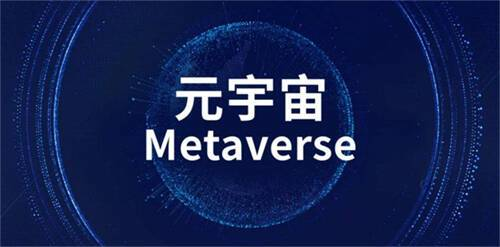
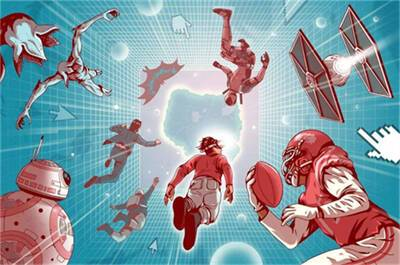

# 2022元宇宙大会圆满落幕：共建共识生态  融入元宇宙时代  

由中国移联元宇宙产业委举办的2022“探索与实验”元宇宙大会已于5月27日至29日在线上平台央链直播火爆召开，本次元宇宙大会聚集了行业顶尖，通过名企对话、专题互动、学术研讨等方式沟通元宇宙的发展共识，搭建国内首个共识交流平台，让技术的发展、实业的结合、生态的参与、各方的治理都能够充分展示、协同共识向好共生。

很多参与本次元宇宙大会的专家学者都纷纷表示，“产业加元宇宙”如同万物复苏争相发展，百花齐放百家争鸣，同时又都在寻求融合融通、生态发展、有序治理等方面的共识共建，相互靠拢又要独树一帜，不过元宇宙尚处于早期阶段，未来必将带来巨大的社会变化，拉动元宇宙消费升级推动元宇宙产业进一步升级。

**共建共识生态  融入元宇宙时代**

三十年前——1992年，尼尔·斯蒂芬森的科幻小说《雪崩》出版，提出“元宇宙”(Metaverse)新物种概念，开启“源起共识”。三十年前——1990年，钱学森先生以中国味的“灵境”(Virtual Reality)和“大成智慧”预言了今天的元宇宙，带来“先导共识”。

三十年后——2021年，纪念钱学森诞辰110周年并尊崇钱老为“元宇宙(灵境)之父”，《元宇宙产业宣言》建立“定位共识”，释义“元宇宙”是前沿数字科技与文化智慧的集成体，倡导六大方向：坚持以人为本，坚持融合融通，坚持匠心精神，坚持知行合一，坚持行业自律，共创元宇宙数据价值未来生态;坚持开放合作，共建元宇宙全球创新发展共同体。

三十年后——2022年，元宇宙共识大会致力于凝聚“发展共识”，从理念与产业、生态与治理、技术与应用方面互动，以元宇宙发展思路为己任，分别深入研讨工业元宇宙、文旅元宇宙、科教元宇宙、商贸元宇宙、金融元宇宙、大健康元宇宙、城市元宇宙、政务元宇宙等，推进“元宇宙创新成果”从概念到实验，再到试验，再到全面实践普遍融入，谋求元宇宙快速健康可持续发展。

每一次人类文明的演进往往会经历新技术、新金融、新商业、新组织、新规则、新经济、新文明这七个阶段，元宇宙也不例外。从新技术的创新和应用开始，构建相匹配的新金融体系，并孕育新的商业模式，从而跨越鸿沟、实现普及，进一步催生新的组织形态，推动制定新的规则，进而重塑形成新的经济体系，最终引领社会走向新的文明形态。

元宇宙作为未来最关键的趋势，和我们每个人都有着非常密切的关系。它不但会改变每个人的生活、每家企业的经营方式，甚至会对整个人类社会的文明组织方式和世界的运行结构带来翻天覆地的变化。不过也有专家学者表示，元宇宙或在将来带给我们另外一种完整的新生态体验。但真正实现还是需要时间和技术的把关。

**元宇宙正当时 新“文艺复兴”里程碑**

如果说，在黑暗的欧洲中世纪，文艺复兴是理清了人和审美的关系，那么目前元宇宙的摸索与进步，则是着力于厘清数-物的融合，即数字经济与实体经济融合，数字资产与实物资产融合，数字社会与现实社会融合，数字身份与现实身份融合等两个世界的深度耦合。

从数字DNA到意识形态整合器，元宇宙的发展亟需某些共识的达成，这种共识应该是一群人经过理性思考以后达成的思想精粹、是系统的意识属性的理性表达，因此，这种共识将既不是一两个人孤芳自赏的精品，也不是群体狂热下吹捧出来的流俗凡品。

作为以从共识结构演变为共治结构的逻辑和社会体系，是一个依理建构的思想过程和实践结构。在这个生态体系中，人类逐渐从“在线”升级到“在场”，除了信息和数据，未来元宇宙社会形态还将会形成一个超历史空间，其颗粒度、复杂度与长周期决定了没有任何一家企业或者机构可以独自成功，共建生态，融入元宇宙未来是必由之路。

因此，在这个新旧交替的关键时期，如何超越自我在元宇宙中实现价值传递，也是与会专家们都非常关心的问题，对于元宇宙的发展，很多人的态度是审慎且又充满希翼的。审慎来自于科研传统，大胆假设，小心求证;希翼是来自于行业共识，希望元宇宙一如二十年前的“互联网”，带来生产生活方式的深度变革，让物理信息两化融合创造新的奇迹，这每一个板块都处在行业探索期，还有巨大的潜能等到释放。

在本次元宇宙大会的闭幕式上，中国移动通信联合会会长、元宇宙产业委共同主席倪健中做了发言，“元宇宙共识大会永远没有谢幕的一天，这是一个场永不谢幕也不会谢幕的大会，现在我们这幅元宇宙盛典的大幕才刚刚来开，现在只是序章阶段。后面元宇宙肯定会越做越好，越做越强。我们也要大众创业、万众创新，真正做到全民参与，争取让每个人都分到元宇宙发展的红利，元宇宙这个让全民狂欢的时代正向我们悄然走来。”

正如他所说，元宇宙的发展已经到了一个新的阶段，元宇宙是是基于真实世界延伸出来的虚实融合的世界，并不是新的虚拟世界。元宇宙覆盖的内容已经不仅仅是信息的表示、呈现和传播，也不会仅仅局限在人类的消费环节，甚至也不仅仅只关系到人类的生产消费领域，元宇宙包含了人类生产生活的全部内容，包括了人类的文化、风俗、习惯、法律、治理等诸多内容。未来的每个人都会像适应移动互联网时代一样学着适应元宇宙时代的生活。

**未来已来  只是尚未流行**

“十四五”期间是我国虚拟现实产业走向集约优化的关键时期，虚拟现实技术迎来长足发展，才能赋能数字经济稳健前行。

而一个成功元宇宙的特征应该是良好的用户体验，开放的协议，完备的经济体，DAO的治理方式，完备的经济体系。作为全国首个元宇宙行业机构—中国移动通信联合会元宇宙产业委员会，是负责推动元宇宙产业健康与可持续发展的聚合平台、“元宇宙共识圈”的主要推手。正是因为看到了这个具有历史意义的转折点的重大契机，引领元宇宙产业“扎根现实、以虚促实、以虚强实”的逐步明确的发展方向，凝聚全新“发展共识”，助力实现数字经济与实体经济深度融合，从而切实赋能实体经济全面升级，让各行各业都能找到“第二曲线”新发展空间，增强更加透明和高效的产业场景。

中国移动通信联合会元宇宙产业委员会执行主任委员于佳宁与何超秘书长，其去年在中信出版的《元宇宙》中曾经提到，在元宇宙时代，“万物互联”将逐步走向“万物互信”，再到“万物交易”和“万物协作”，因此从产业、数权、组织、身份、文化、金融等多方面总结出元宇宙的五大融合，六大趋势，即为数字经济与实体经济深度融合、数据成为核心资产、经济社群崛起壮大、重塑自我形象和身份体系、数字文化大繁荣和数字金融实现全球普惠等。

于佳宁博士认为，目前元宇宙的机遇窗口期正在逐步开启，未来十年是元宇宙发展的黄金期，更多的财富都会在数字世界中创造，数字财富也会改变更多人的生活，每个人可能都需要具有全新的资产配置的策略和思维框架，元宇宙是现实世界和虛拟世界的交融与延伸，是人类数字化生存迁移的载体，带来的机遇与挑战，是每个创新企业不得不思考的问题。他建议各不同区域的创新体系在服务于国家整体创新体系需求的同时，应牢牢抓住整体效能提升所带来的正外部性，推动和促进元宇宙的共识的快速发展。
