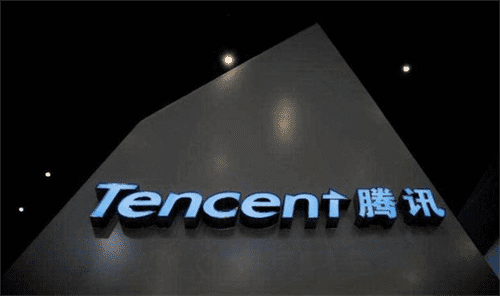

# 中国元宇宙app官网链接 元宇宙数字藏品交易平台 

越来越多的科技巨头开始投身到元宇宙的洪流里，越来越多的玩家开始把元宇宙看成是发展的重点，一场以元宇宙为主导的全新发展时代已然来临。在元宇宙的热潮中，有很多便宜想要从一些中国元宇宙app官网平台以及一些元宇宙数字藏品交易平台找到相关讯息，为大家推荐一个元宇宙网站——斗极元宇宙（[官方地址点这里](https://demo.metabd.io/)），关于元宇宙的信息十分丰富且更新及时。下文将继续为大家带来关于元宇宙的最新行业动态。

当元宇宙的概念开始火爆的第一天开始，人们便开始将其与腾讯联系在了一起。尽管腾讯方面并未真正意义上对外宣布全面投身到元宇宙当中，但是，人们的揣测似乎并不减少多少。于是，人们为了佐证他们的判断，便会时不时地拿出一些腾讯现有的东西和元宇宙关联在一起。这就给人一种错觉，腾讯似乎具备天然的元宇宙特质，而投身到元宇宙的洪流里，似乎也是一种理论正确。

当互联网时代渐行渐远，我们看到的是以数字化、智能化为主导的全新时代的来临。在这样一个全新的时代，我们将会面临的是，有关互联网的物种所开启的一场深度而又彻底的改变。而元宇宙，正是在这样一个大背景下诞生的。当元宇宙所裹挟着的诸多的技术，诸多的模式，诸多的想象，与人们那颗迫切需要改变的心碰撞在一起的时候，便迸发出了强大的热情和火花。

因此，腾讯与元宇宙产生联系是一种必然。笔者认为，腾讯之所以依然还保持冷静与克制，其中一个很重要的原因在于，它还没有找到与元宇宙结合的方式和方法而已。一旦腾讯方面找到了投身到元宇宙的方式和方法，所谓的投身元宇宙，或许是迟早的事情。

**元宇宙基础设施，腾讯业已具备**

任何一个投身到元宇宙的玩家，必然都会经历一定的积累，必然需要具备元宇宙的基础设施。只有有了元宇宙的基础设施，它们才会投身到元宇宙之中，而如果缺乏元宇宙的基础设施，所谓的投身到元宇宙，或许仅仅只是一种噱头和概念而已。无论是Facebook，还是其他的玩家，几乎都是如此。从腾讯方面来看，有关元宇宙的基础设施，早已具备和完善。

无论是腾讯在互联网业已构建起来的以社交为主导的强大的生态体系，抑或是近年以来腾讯在新技术上的深度布局，我们都可以非常明显地看出，腾讯业已构建起来了强大的有关元宇宙的基础设施。有关布局元宇宙，仅仅只是腾讯的「箭在弦上，何时发」的问题。

正是由于腾讯方面有关元宇宙的基础设施的丰富和完善，所以，才会有那么多的人会如此笃定腾讯将会投身到元宇宙之中。那么，腾讯为何依然没有高调宣布投身到元宇宙之中呢？笔者认为，其中一个很重要的原因在于，当下的元宇宙依然是一个以资本为主导的存在，诸多的元宇宙玩家之所以会投身到元宇宙之中，仅仅只是为了赢得资本的关注，将元宇宙看成了一个噱头和概念。

对于腾讯来讲，它并不需要用这样一个概念来赢得资本市场的关注，它更加关注的是，如何借助元宇宙来改造自身的生态体系，并且为自身的发展找到第二条曲线的问题。正是因为如此，腾讯才没有宣布投身元宇宙，而仅仅只是将元宇宙看成是一个布局的点。等到元宇宙市场不再被资本裹挟，特别是不再被概念和营销充斥，以腾讯为代表的互联网大厂必然会投身到元宇宙之中，并且真正将元宇宙看成是一个打开新发展的抓手。

需要明确的是，尽管没有名正言顺地宣布会投身到元宇宙之中，更没有像Facebook那样通过彻底的改名来彰显自身投身元宇宙的决心，但是，这并不代表腾讯没有进行前瞻性的布局。我们看到的，腾讯在区块链技术上的布局，腾讯在社交领域的尝试，基本上都是在为元宇宙架桥铺路，等到一切条件具备之后，腾讯投身到元宇宙，或许仅仅只是「欠一股东风」的问题。

**元宇宙的发展趋势，腾讯无可避免**

虽然人们一直都在谈论元宇宙的泡沫，虽然人们一直都在强调元宇宙是概念和噱头，但是，这丝毫无法诋毁元宇宙是未来的发展潮流和趋势的现实。可以预见的是，当元宇宙不断地成熟和完善，它取代互联网，依然成为一种必然。对于腾讯来讲，应对元宇宙发展的大趋势，并以此来作为互联网的替代品，才是关键所在。

提及元宇宙，人们自然而然地会将其与资本在背后的推波助澜联系在一起，甚至还有干脆就把元宇宙看成是一个资本的产物。但是，如果深入分析元宇宙背后的发展逻辑，特别当我们将元宇宙与当下用户的需求联系在一起的时候，我们就会发现，资本市场仅仅只是看到了这样一个趋势，并且将这样一种发展趋势具象化了而已。

那么，究竟是怎样的一种趋势造就了元宇宙呢？笔者认为，这样一种趋势可以归结为用户对于新的体验，新的商业模式，新的技术的需求的不断增加。换句话说，互联网技术业已无法满足用户的这样一种需求。于是，我们需要用新的体验，新的商业模式，新的技术来满足用户需求的改变。而元宇宙，正是用户需求的具象化，而资本仅仅只是将这样一种需求放大了而已。

由此可见，我们与其将元宇宙的诞生和发展，看成是资本在其中的推波助澜，不如将元宇宙的诞生和发展，看成是用户需求的衍生和嬗变。对于腾讯来讲，如何满足用户的新需求，如何保持自身在互联网时代积累下来的优秀的成果，并且将这样一种成果继续发扬光大，迎合用户需求的改变，用新的物种来满足用户的需求，俨然成为了一种政治正确。从这个逻辑上来看，腾讯投身到元宇宙，依然是一种必然。

**元宇宙，全真互联网的具体诠释**

当元宇宙的概念日渐火爆，或许早就有人忘记了马化腾早在元宇宙尚未火爆的时候，便已经提出过「全真互联网」的概念。笔者印象最深的是，在全真互联网的概念当中，马化腾提出了虚拟与实体融合，线上和线下融合等诸多大胆的畅想，而这些大胆的畅想背后，为我们展现出来的，正是当下元宇宙为我们呈现的场景。如果腾讯方面一定要将马化腾的「全真互联网」付诸实现的话，那么，元宇宙，同样是一个不可或缺的重要方面。

同样地，我们现在看到的是一场互联网回归实体，回归产业的全新发展潮流，从某种意义上来讲，互联网玩家们的回归产业，回归实体，其实就是在寻找以互联网为代表的虚拟经济和传统产业为代表的实体经济的结合的方式和方法。在这样一场全新的结合过程当中，我们需要用新的概念来诠释它，而元宇宙无疑是一个与时俱进的全新的概念。

从这个角度来看，无论是站在将马化腾的「全真互联网」付诸实践的角度，还是站在将拥抱产业，拥抱实体落地和应用的角度，我们都是需要像元宇宙这样的概念的加持的。当元宇宙成为了落地和实践全真互联网的一种方式和手段的时候，它本身对于C端用户的附着力，以及它本身所涵盖的一系列的新技术，都将开启腾讯拥抱实体经济，助力实体经济的全新模式。

**结语**

有关腾讯与元宇宙的猜想依然还会持续。笔者认为，腾讯与元宇宙之间的联系是天然的，也是必然的。之所以当下腾讯依然还未大张旗鼓地宣布投身到元宇宙之中，其中一个很重要的原因在于，当下的元宇宙依然还是初级的，依然还是狂热的，依然还是充满泡沫的。但是，这丝毫无法抵消腾讯与元宇宙之间的天然联系。无论将来腾讯会以怎样一种形式投身到元宇宙之中，它都将是元宇宙时代不可忽视的力量。

—完—

转载自：孟永辉，资深撰稿人，专栏作家，特约评论员，行业研究专家，战略咨询顾问。长期专注行业研究，提供行业深度思考。
