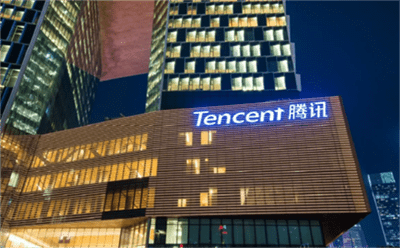
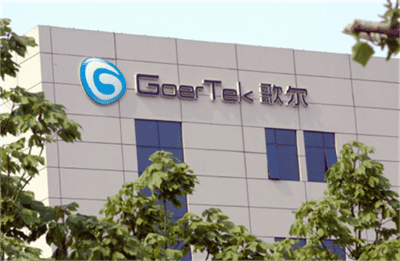

# 元宇宙app官网入口 国内元宇宙概念公司盘点

2022年业已过半，全球范围内关于元宇宙的探索依旧在如火如荼地展开。由Meta、微软、Epic、英伟达、高通、索尼等36家组建的“元宇宙标准论坛（Metaverse Standards Forum）”正式成立。这一举动，将元宇宙的热度再一次推向高潮。关注元宇宙的你，一定不想错过关于元宇宙的最新动态，想要找到元宇宙app官网入口。为大家推荐一个元宇宙网站——斗极元宇宙（[官方地址点这里](https://demo.metabd.io/)）。

下文继续为大家带来元宇宙的信息，将从内容端和硬件端两个方向出发，盘点目前国内头部元宇宙企业。

#### 内容端

**腾讯：**公司通过资本（收购&投资）+流量（社交平台）组合拳，探索与开发元宇宙。通过投资EpicGames、Snap分别占据了VR/AR生态的有利地位，在社交、游戏、企业服务等领域的优势为内容场景奠定基础。

6月27日，腾讯正式成立“扩展现实”（XR-ExtendedReality）部门，正式将赌注押在虚拟世界的元宇宙概念上。消息指出，该部门的任务是为腾讯建立包括软件和硬件在内的扩展现实业务，并将成为公司互动娱乐事业群（IEG）的一部分。

**字节跳动：**2021年8月，字节跳动收购VR头显厂商Pico，补足了硬件短板，为自身内容流量找到新的入口。在内容与场景方面，抖音、西瓜视频、Faceu 激萌、飞书、图虫等产品矩阵覆盖全球超150个国家和地区，流量全球化。

**网易：**与三亚市政府签署战略合作协议，网易将在三亚设立网易海南总部，建设网易元宇宙产业基地项目。此外，双方还将在互动娱乐、电子竞技、音乐文化、电商直播、在线教育等领域深化合作。

**芒果超媒：**湖南广电将以国家广播电视总局5G重点实验室为基座，与中国移动以芒果超媒为合作契机，探索搭建芒果“元宇宙”平台，全面参与未来传播形态竞争。公司将通过“互动+虚拟+云渲染”三个方面构建芒果元宇宙的基础架构。已上线泛娱乐内容社交平台“芒果幻城”。

**爱奇艺：**《2021易凯资本元宇宙报告》指出，“短期内，元宇宙的突破口是游戏、社交与沉浸式内容。拥有大量可沉浸内容版权和一定VR内容产出能力的爱奇艺有相当大的机会去争夺通往元宇宙的门票。”

**哔哩哔哩：**站高能链是为新应用、文化、游戏以及数字资产构建的数字原生社区。其3大应用场景分别为数字藏品（NFT）、数字身份，以及版权。同时，能够为用户提供原创作品上链、NFT藏品展厅、虚拟宠物、偶像互动、数字身份及低调向他人展示自己身份这6个方向的服务。

**三七互娱：**在内容生态方面，公司已通过投资覆盖AR/VR、影视、动漫、音乐等内容形态以及社交、体育健康等应用场景。在AR/VR领域，公司投资了优质的VR内容研发商加拿大Archiact，后者研发的《Evasion》经权威媒体Metacritics评分77分，打入VR游戏历史前十。

**世纪华通：**公司旗下自研元宇宙游戏《LiveTopia》登陆全球最大的元宇宙社区Roblox平台，月活用户超过4000万，最高日活突破500万，累计访问突破6.2亿次，在Roblox平台上的用户数超过1亿，是国内最成功的元宇宙游戏。

**昆仑万维：**仑万维在2021年完成了对Opera和Star Group的并购，根据美股公开报告显示，2021年Opera平均月活跃用户近3.6亿，并在拉美及北美地区分别实现35%及22%的快速用户增长。目前Opera通过面向游戏玩家的Opera GX浏览器、面向开发者的游戏引擎GameMaker Studio （GMS）、以及完成两者闭环的游戏社区平台GXC，进行元宇宙打造。

**完美世界：**公司在多人在线角色扮演类游戏、在线娱乐内容产出、引擎、VR/AR、AI等领域优势突出。当前，包括《幻塔》在内，公司还有多个开放世界在研游戏项目，比如《CS：GO》在2020年推出官方虚拟主播古堡龙姬、近期推出永恒娘，以及《DOTA2》在2021年10月推出的官方虚拟偶像dodo，都契合了虚拟数字人的理念。

#### 硬件端

**歌尔股份：**公司为国内领先的消费电子零部件和整机供应商，VR/AR硬件制造在总营收中占比达四成，且客户都是VR领域头部厂商，如Oculus、索尼、HTC和Pico等，这是歌尔股份的核心竞争力，也是元宇宙时代支撑增长的最重要支点。

**京东方A：**公司能够为VR/AR/MR智慧终端提供显示解决方案，其中包括高PPI、高刷新率的FastLCD和超高分辨率、超高对比度的硅基OLED等极具代表性的显示技术。

**东山精密：**公司积极布局VR/AR相关赛道，成为Oculus Quest2 软/硬板核心供应商。公司还是苹果产业链的中国供应商之一。在苹果发布自己的MR头显之后，元宇宙概念产品份额的提升将进一步凸显公司竞争力。

**欧菲光：**公司在VR/AR透镜、VR/AR模组方面优势明显。公司在南昌成立虚拟现实研究院，投资了国内领先的PC VR头显厂商小派科技。

**利亚德：**利亚德已依托自研动捕产品立足研发，布局数字人、数字资产等元宇宙相关产业方向，建立数字人校企联合实验室的同时，逐步建设数字资产平台，储备数字资产。利亚德旗下德火科技自主研发的DRS系统，基于DRS系统的AR沉浸式全景仿真系统、MR混合现实拍摄等多类型解决方案已广泛应用于全球市场。

**舜宇光学：**舜宇光学是全球知名的车载镜头出货商，公司的VR类镜头与镜片及3D交互式镜头已实现供货销售。2022年上半年，舜宇光学完成800万像素英伟达系列自动驾驶车载镜头的研发。此外，也完成了全息ARHUD方案配套的核心光学引擎研发，以及VR显示模块和AR彩色波导片的研发。

**长信科技：**公司致力于“元宇宙”产业链的建设，VR项目从2019年12月开始布局，2020年3月份项目开始立项，2020年7月份进入量产，现每月产能峰值达到1KK/月；公司为Meta及国内VR厂商提供最新款VR Quest2显示模组。

**创维数字：**公司在只能硬件入口方面，将持续投入资源进一步深度研发VR智能终端，2022年将上市具有折叠光学方案的六自由度VR硬件终端；公司在内容生态方面，将在游戏、教育和医疗方面加大投入，引入合作内容。

**R蓝思科技：**蓝思科技在VR/AR生产所需的工业设计、传感器、光学设计、系统集成、大规模量产等底层核心技术上积累较深，业务上，拥有苹果、微软、华为、小米、索尼等一线客户资源。

**水晶光电：**公司主要产品包括滤光片、光学低通滤波器和组合片、智能眼镜光学模块等AR、VR、MR新的显示技术等相关储备。

