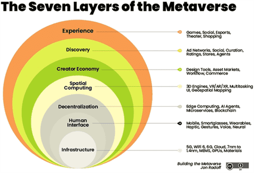

# 元宇宙app官网 元宇宙区块链数字藏品NFT平台 

2021年，元宇宙概念席卷全球，这一年也被称作元宇宙元年。大厂纷纷下场，资金疯狂涌入，这把火一直烧到现在。关于元宇宙的热潮还没褪去，如何去伪存真，看到元宇宙的“真面目”，可以关注一个元宇宙网站——斗极元宇宙（[官方地址点这里](https://demo.metabd.io/)）。下文带大家了解一下什么是元宇宙。

**元宇宙是现实世界的投射**

元宇宙听起来很科幻。

想搞清楚元宇宙的概念，还真得从科幻片中找灵感。

常见的对未来世界的幻想，往往都有一个不争气的现实世界，和一个无限美好的理想世界。为了到达幸福的彼岸，主角要么冲向宇宙，星际穿越；要么回到过去，时空穿越；要么链接网络，虚拟穿越。

虚拟穿越的彼岸，在1992年的时候，被一本叫《雪崩》的书称作元宇宙。30年过去了，这个词的含义没什么本质变化，或者说它本身就是一个很宽泛的概念。所有虚拟世界的想象及相关技术的演进都能装进元宇宙的大筐里。

科幻片再怎么想象，仍然是现实生活的投射。元宇宙就是利用科技手段营造的赛博空间，是与现实世界映射与交互的虚拟世界。科幻片不会凭空想象，考虑的仍是人类的吃喝拉撒睡，元宇宙同样不能免俗，解决的也是现实世界的需求。

那么，为什么元宇宙兜兜转转30年后，又变成了时髦货呢？资本市场热捧和科技巨头入局的背后，是科幻已经不再停留于想象，而是有了技术及应用投入现实的苗头。

围绕人类整日思考的问题，元宇宙的应用方向可以总结为三个去处：怎么娱乐，怎么工作，怎么生活。

**娱乐：最挣钱、看赛道**

在电影《头号玩家》中，元宇宙的娱乐方式全面呈现。通过VR、体感手套等设备，虚拟世界近在眼前，触手可及。玩家可以打怪，可以跳舞，顺便还谈谈恋爱。

这一切，都在从科幻走向现实，越来越多体现元宇宙玩法的游戏及平台涌现。国外大热的《堡垒之夜》请到明星在游戏中举办演唱会，《我的世界》等沙盒类游戏可以建造属于自己的家，大家操纵着自己的数字分身，有了更多元的游戏体验。

当然，在电影拍不到的地方，还有运算技术与基础设施在背后支撑。与应用逐渐丰富相伴的，5G、云、3D引擎、AI、边缘计算、数字孪生……各种听说过没听说的科技硬词都有了突破和应用。

为什么娱乐成了元宇宙的开拓先锋？

因为游戏最挣钱。万事开头难，游戏强大的变现能力，成为元宇宙的先行者，一方面推广新方向，另一方面也推动新发展。没有了切西瓜，VR就很难获得第一批体验者，而玩游戏中存在晕眩感的毛病，又促进了显示技术的优化。

元宇宙游戏领域的投资，与同样火热的新能源车有类似之处：商业化成熟，但技术路径上仍有博弈。AR、VR、MR……技术不断迭代，互相争夺市场。可以想见，一旦一种技术路径一统江湖，背后都将是软硬件整个产业链的腥风血雨。

因此，要想参与投资，投资框架既要深入到研发水平、成本控制、销售能力、用户体验等评判成熟企业的价值逻辑，更要站在技术路径大方向上选对赛道。

**工作：最火热、看审美**

号称“元宇宙第一股”的Roblox，乍一眼看上去就是海外版4399小游戏平台。那么，为何Roblox能获此殊荣呢？很重要的一点就是引入了创作者经济系统。

在Jon Radoff提出的元宇宙七个层次中，创作者经济道出了在元宇宙中“打工挣钱”的核心模式。

在Roblox上，不仅可以玩游戏，还可以创作游戏在平台销售。平台为创作者提供了一套创作工具，还提供了交易用的虚拟货币Robux，而Robux可以与真金白银兑换。

Robux和以前常见的充值后的金币、点券等代币有什么区别？

一般情况下，砸钱充值后，只能局限在这个平台消费，且不可能再换回现金。对于平台以外的人来说，这类代币一文不值。在兑换充值的那一刻，代币在现实世界的货币价值就灰飞烟灭了。

至于使用代币购买的游戏皮肤、武器等道具，就更无法与货币价值画上等价关系了。哪怕坐拥传说级、典藏级皮肤，对于其他人来说最多也就评价个好看，没办法说是值钱。事实上，皮肤不过是一串1和0构成的代码，平台可以随意的复制，玩家也会大量的拥有。

最近炒得很热的NFT，为什么不只是一串数字，而变成数字资产了？关键在于区块链技术为其赋予了防伪的特性。虽然还是一串代码，但它是一串独一无二的代码。试想，一副梵高的真迹和一张翻拍的照片，其价值完全是两个概念。

很多人对NFT审美不能，无法理解为何能卖出天价。那么试想一下，当你参观山顶洞人制造的石器时，或许很难夸赞其精美，但一定会明白它很值钱。新兴的数字藏品有了技术突破带来的增值效应。甚至可以说，此时的收藏带有些古董收藏的含义。

面对元宇宙，我们多数人都是“山顶洞人”，每个人都有机会制造属于自己的石器。尽快学会元宇宙的劳动方式，使用工具，创造价值，就有机会率先进化，获得新时代第一桶金。

当然，随着更多人加入到NFT的创作中，数字收藏品最后还是要回归到审美上来。还是那句话，元宇宙是现实世界的映射。倘若开一档《鉴宝》的栏目，也得打上收藏有风险，投资需谨慎的标语。

**生活：最关键、看监管**

互联网经历了web1.0与web2.0时代，正在朝web3.0演进。

1.0时代，我们刚刚成为网络公民，享受着匿名潜水的狂欢。门户网站大量崛起，我们的身份主要是消费者，主要动作是被动的阅读。

2.0时代，随着移动互联网的普及，UGC（用户生产内容）充分调动起网友的自主性，在社交平台灌水成了常态，大量互联网平台企业诞生。

而3.0时代的要义是去中心化。

我们在互联网平台上进行社交与交易，虽然还是匿名，也能通过UGC挣着钱了，但是，总有平台在中间过道手、把控着。

随着平台越来越大，压榨创作者，欺负消费者的事情就越来越多。通过算法，平台主导着流量的去处，打破了自愿与公平交易的原则，垄断的尾巴翘了起来。所谓的平台生态，说白了就是把鱼缸扩建成水族箱，还是想把鱼和水都给圈起来。平台的流量与收益无法自由迁移到其他平台，实际上互联网海洋冲浪的快感在逐渐被巨头筑起的围墙切割。

这些壁垒势必要打破。web3.0绘制了去中心化的蓝图，区块链等技术正在推动其实现。

如果说元宇宙中的娱乐与工作方式正在落地，生活方式确实需要更多想象力。再以《头号玩家》为例，通过绿洲（Oasis）的广场，你可以自主选择不同平台提供的体验，无论是开会，还是社交，或者是娱乐。你的身份、财富与社交关系不再被分割，元宇宙居民在其中积累数字资产，拓展社交关系。

颇具讽刺意味的是，巨头纷纷入局一个致力拆墙的世界，看起来像是自己革自己的命。但是，墙虽然拆了，但是虚拟世界就像现实世界一样，仍然需要施工队盖楼，需要服务员上菜。公司抢跑正是为了取得先行者优势，在技术路径、硬件标准、内容类型上抢得先机，就可以更早在元宇宙站稳脚跟滚雪球。

但是，去中心化是一把双刃剑。现实世界的信用背书更多来自权威机构，虚拟世界由区块链取代后，监管部门的缺位可能将虚拟世界的自治社区推向野蛮部落，这也是国内谨慎看待元宇宙的症结所在。如何寻找平衡，是元宇宙必须面临的监管难题。
