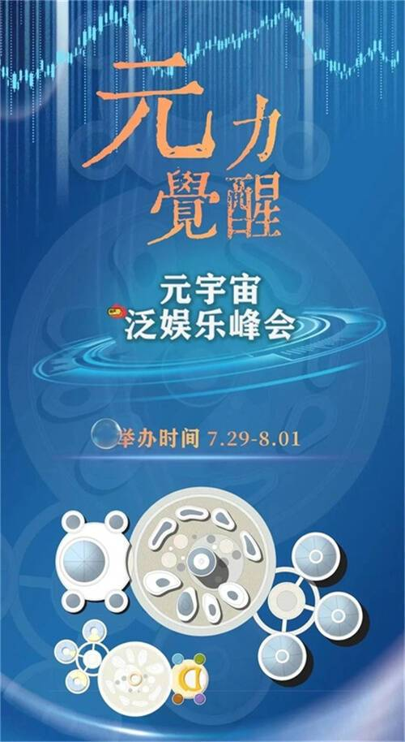
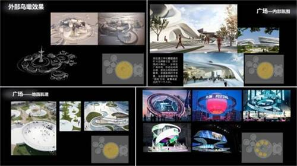
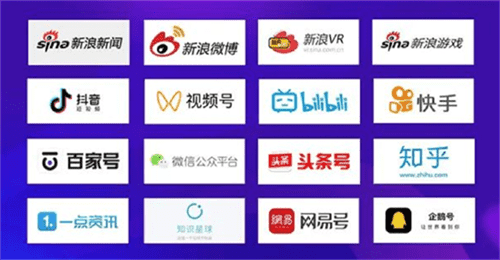
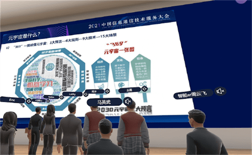
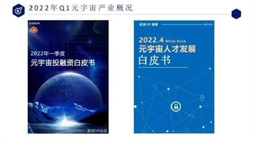

# 元宇宙大会最新消息 2022年元宇宙泛娱乐峰会预热开启

近几个月，国内外各界相继举办了元宇宙大会，国内7月份又有新动作，2022年由新浪VR举办的元宇宙大会定档了——新浪VR元宇宙七月峰会将于7月29日-8月01日正式展开。

在这次元宇宙大会中，新浪VR将有四大主要升级内容：

**升级一：场馆重磅升级，更多场景、更多功能！**

通过前两次的元宇宙会议，新浪VR在业内率先积累了实践经验，并结合嘉宾、厂商、媒体和参会观众的建议作出了针对性改进。与此同时，新浪VR与场地提供方携手并进，对会场进行了整体大升级，内容包括数个新增场地，并加入众多全新且人性化的系统功能，力图让所有参会者体验到最具沉浸度和专业度的元宇宙体验。

**升级二：专业媒体曝光，更多渠道、更多推广！**

一直以来，新浪VR深知媒体传播的重要性。在前两次的会议里，新浪VR对会议进行了全程直播与记录，并同步登陆新浪新闻、新浪微博、新浪游戏、抖音、视频号、哔哩哔哩、快手和百家号等头部网络媒体。此举在给大会带来更多关注的同时，也让业内人士的专业观点和企业形象得到了更好的宣传。

在本次七月峰会中，新浪VR还将对媒体渠道进行升级，在以往效果的基础上更新和加大推广力度，力求在元宇宙浪潮里发出当之无愧的“最强音”。

**升级三：全新数字藏品，设计精美、极具价值！**

2021年，新浪VR在《新浪VR2021年度行业颁奖盛典》里率先推出了全球首座经过NFT认证的数字奖杯。在元宇宙时代，新浪VR期望用纯数字化的形式嘉奖业内厂商改善人类生活的美好初心，并祝福他们打造出难以复制的商业模式和无限潜力的商业价值。

在本次七月峰会里，新浪VR将延续这一优良传统，再度推出新款数字藏品，具体内容敬请期待……

**升级四：更多嘉宾到场，行业高管、网红大V！**

新浪VR始终保持大会的专业度和影响力，坚持邀请业内重磅嘉宾到场，并与所有观众分享精华内容。作为举办方，新浪VR对此深感荣幸，并引以为豪。在本次的七月峰会里，新浪VR会加大邀请力度，在保证业内高管和专业人士到场的同时，再加入众多KOL级别的嘉宾，让峰会的关注度再次升级。

**升级五：多份重量级白皮书披露**

一直以来，新浪VR都会借助自身的门户媒体优势，将行业内的精确数据与分析报告进行汇总，进而制作出专业、严谨且极具时效性的行业报告、白皮书。就在2022年四月峰会里，新浪VR已向业内隆重推出了《2022年一季度全球元宇宙投融资》和《元宇宙人才发展》（与猎聘联手打造）两份极具参考意义的行业白皮书，并向全网提供免费下载，此举也收到了业内外人士的广泛好评。

在七月峰会里，新浪VR将在过往基础上保持精进，对于元宇宙、XR以及相关领域的数据整理工作升级，更多专业性专业性极高的内容将被正式加入。同时，新浪VR也会将继续对白皮书进行现场发布和解读，旨在帮助所有参会者理解最新元宇宙数据，以确保其在元宇宙赛道的准备中不落人后。
